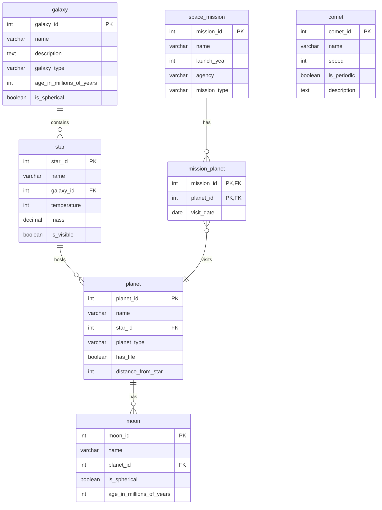

# Space Exploration Universe Database System

**Practical Mini Project — Database Management System**

---

## Overview

Modern space research organizations manage enormous amounts of hierarchical astronomical data including galaxies, stars, planets, moons, and other celestial objects. Efficient storage, retrieval, and analysis of such structured data requires a well-designed relational database that enforces relationships and maintains data integrity.

This mini project focuses on building a Space Exploration Universe Database System that models celestial hierarchies using relational database principles. The system allows tracking of galaxies, their stars, planetary systems, and associated moons while also storing independent objects such as comets. The project demonstrates how hierarchical scientific data can be structured using normalized tables and enforced using foreign key constraints.

The objective is to explore database design concepts such as entity relationships, constraints, normalization, indexing, analytical querying, and performance optimization. The database supports realistic analytical queries like identifying habitable planets, analyzing star distribution across galaxies, and studying planetary satellite systems.

---

## Entities and Relationships

### Entities

- **Galaxy**: galaxy_id, name, description, galaxy_type, age_in_millions_of_years, is_spherical
- **Star**: star_id, name, galaxy_id, temperature, mass, is_visible
- **Planet**: planet_id, name, star_id, planet_type, has_life, distance_from_star
- **Moon**: moon_id, name, planet_id, is_spherical, age_in_millions_of_years
- **Comet**: comet_id, name, speed, is_periodic, description
- **Space_Mission**: mission_id, name, launch_year, agency, mission_type
- **Mission_Planet**: mission_id, planet_id, visit_date

### Relationships

- **One-to-Many**: Galaxy → Star
- **One-to-Many**: Star → Planet
- **One-to-Many**: Planet → Moon
- **Many-to-Many**: Space_Mission ↔ Planet (via Mission_Planet junction table)
- **Cascading Dependency**: ON DELETE CASCADE prevents orphan records

The junction table enforces composite primary keys ensuring relational consistency.

---

## ER Diagram



---

## Database Architecture

### Core Hierarchy

Galaxy → Star → Planet → Moon

### Mission Tracking Layer

Space_Mission ↔ Mission_Planet ↔ Planet

This structure ensures clean separation of concerns and eliminates redundancy.

---

## Key Concepts Demonstrated

- One-to-Many Relationships
- Many-to-Many Relationship (Mission ↔ Planet)
- Composite Primary Keys
- Foreign Key Constraints with Cascading Rules
- Indexing for Query Optimization
- Transactions (COMMIT / ROLLBACK / SAVEPOINT)
- Analytical Queries with Aggregation
- Window Functions (RANK, DENSE_RANK, ROW_NUMBER)
- Subqueries and Complex JOINs
- UNION and UNION ALL Operations
- Stored Procedures and Error Handling
- Query Plan Analysis using EXPLAIN
- Normalization up to Third Normal Form (3NF)
- ACID Properties in Practice

---

## Sample Analytical Queries

### Galaxy with Highest Average Star Temperature

```sql
SELECT
    g.name AS galaxy_name,
    ROUND(AVG(s.temperature), 2) AS avg_temperature_kelvin,
    COUNT(s.star_id) AS star_count
FROM galaxy g
JOIN star s ON g.galaxy_id = s.galaxy_id
GROUP BY g.galaxy_id, g.name
ORDER BY avg_temperature_kelvin DESC
LIMIT 1;
```

### Planetary System with Most Moons

```sql
SELECT
    p.name AS planet_name,
    COUNT(m.moon_id) AS moon_count,
    s.name AS star_name
FROM planet p
LEFT JOIN moon m ON p.planet_id = m.planet_id
JOIN star s ON p.star_id = s.star_id
GROUP BY p.planet_id, p.name, s.name
ORDER BY moon_count DESC
LIMIT 1;
```

### Most Active Space Agency

```sql
SELECT
    agency,
    COUNT(*) AS mission_count,
    GROUP_CONCAT(name ORDER BY launch_year) AS mission_names
FROM space_mission
GROUP BY agency
ORDER BY mission_count DESC;
```

### Habitability Distribution Across Galaxies

```sql
SELECT
    g.name AS galaxy_name,
    COUNT(p.planet_id) AS total_planets,
    SUM(p.has_life) AS habitable_planets,
    ROUND((SUM(p.has_life) / COUNT(p.planet_id)) * 100, 2) AS habitability_percentage
FROM galaxy g
JOIN star s ON g.galaxy_id = s.galaxy_id
JOIN planet p ON s.star_id = p.star_id
GROUP BY g.galaxy_id, g.name
ORDER BY habitability_percentage DESC;
```

### Star Temperature Ranking with Window Functions

```sql
SELECT
    s.name AS star_name,
    s.temperature AS temperature_kelvin,
    g.name AS galaxy_name,
    RANK() OVER (ORDER BY s.temperature DESC) AS temperature_rank,
    DENSE_RANK() OVER (ORDER BY s.temperature DESC) AS temperature_dense_rank
FROM star s
JOIN galaxy g ON s.galaxy_id = g.galaxy_id
ORDER BY temperature_rank;
```

---

## Transaction Example (ACID Demonstration)

### Basic Transaction with Mission and Planet Visit

```sql
START TRANSACTION;

-- Insert a new space mission
INSERT INTO space_mission (name, launch_year, agency, mission_type)
VALUES ('Deep Survey', 2026, 'ISRO', 'Research');

-- Link the mission to a planet visit
INSERT INTO mission_planet (mission_id, planet_id, visit_date)
VALUES (LAST_INSERT_ID(), 3, '2026-07-10');

-- Commit the transaction
COMMIT;
```

### Advanced Transaction with Savepoints and Error Handling

```sql
START TRANSACTION;

-- Insert mission
INSERT INTO space_mission (name, launch_year, agency, mission_type)
VALUES ('Test Mission', 2025, 'NASA', 'Test');

SAVEPOINT mission_inserted;

-- Insert planet visit
INSERT INTO mission_planet (mission_id, planet_id, visit_date)
VALUES (LAST_INSERT_ID(), 1, '2025-01-01');

-- If something goes wrong, rollback to savepoint
ROLLBACK TO SAVEPOINT mission_inserted;

-- Commit only the mission
COMMIT;
```

Rollback protection ensures database consistency.

---

## Performance Optimization

- Indexes created on all foreign key columns
- Index on `planet(has_life)` for fast filtering
- Composite primary key in `mission_planet`
- Query performance verified using `EXPLAIN`
- Cascading deletes prevent orphan records

---

## Normalization Justification

### 1NF
All attributes contain atomic values. No repeating groups.

### 2NF
Non-key attributes fully depend on the primary key. In the junction table, attributes depend on the composite key.

### 3NF
No transitive dependencies exist. For example, galaxy details are not duplicated in the star table; instead, they are referenced via foreign key.

The schema eliminates redundancy and maintains consistency.

---

## Project Structure

```
MiniProjects/
├─ ERD/
├─ Notes/
│   └─ README.md
├─ Screenshots/
│   ├─ Analysis/
│   ├─ Rollback/
│   └─ Transaction/
└─ SQL/
    ├─ analysis.sql
    ├─ rollback.sql
    ├─ schema.sql
    ├─ seed.sql
    └─ transaction.sql
```

---

## Tech Stack

- MySQL 8+
- Docker
- Mermaid (ER Diagram)
- VS Code

---

## Learning Outcomes

This project demonstrates the ability to:

- Design normalized relational schemas with proper constraints and indexes
- Implement advanced SQL queries with window functions and complex aggregations
- Optimize database performance through strategic indexing and query analysis
- Model complex real-world relationships including many-to-many associations
- Apply transactional control with ACID properties, savepoints, and error handling
- Write production-ready SQL scripts with comprehensive documentation
- Perform analytical data analysis using subqueries, joins, and statistical functions
- Handle database errors and implement rollback strategies
- Create maintainable database code following best practices

---

## Notes

- Executed using Docker MySQL container
- Demonstrates normalization, joins, aggregation, indexing, and views
- Indexing used for FK performance and habitability queries
- ER diagram generated using Mermaid in VS Code
- SQL scripts are portfolio-level with comprehensive comments, advanced queries, and error handling
- Includes 12+ analytical queries showcasing window functions, subqueries, and complex aggregations
- Transaction examples demonstrate ACID properties with savepoints and rollback scenarios
- Schema includes detailed table comments and performance-optimized indexes
- This mini project represents the final integrated schema with production-ready SQL code

---

## Maintainer

Maintained by **Himanshu Jadhav**  
Second-Year Engineering Student (AI & Data Science)

[GitHub](https://github.com/himanshu-jadhav108) • [LinkedIn](https://www.linkedin.com/in/himanshu-jadhav-328082339) • [Instagram](https://www.instagram.com/himanshu_jadhav_108?igsh=MWYxamppcTBlY3Rl) • [Portfolio](https://himanshu-jadhav-portfolio.vercel.app/)