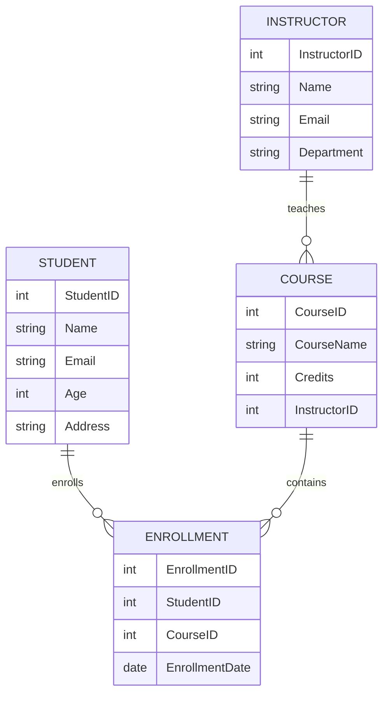

# Practical 1 — Database Setup and Creation

## Problem Statement

Setup and create a database using MySQL/PostgreSQL.

### Entities and Relationships

* Student(StudentID, Name, Email, Age, Address)
* Course(CourseID, CourseName, Credits, InstructorID)
* Instructor(InstructorID, Name, Email, Department)
* Enrollment(EnrollmentID, StudentID, CourseID, EnrollmentDate)

### Relationships

* A student can enroll in multiple courses.
* A course can have multiple students.
* An instructor teaches one or more courses.

---

## Theory

This practical introduces relational database design using entities, attributes, primary keys, foreign keys, and relationships.

Student and Course form a many-to-many relationship. This is resolved using the Enrollment table, which acts as a junction table and stores additional details such as enrollment date.

Instructor and Course form a one-to-many relationship where one instructor can teach multiple courses.

Primary keys uniquely identify records, while foreign keys maintain referential integrity and prevent invalid references.

Understanding these concepts is essential for designing scalable relational systems.

---

## SQL Overview

Tables created:

* Student
* Instructor
* Course
* Enrollment

The Enrollment table resolves the many-to-many relationship between students and courses.

Queries demonstrate joins and aggregation to reconstruct relationships.

---

## ER Diagram

---

## Notes

Schema executed using MySQL Docker container.
ER diagram generated using Mermaid in VS Code.
The Enrollment table acts as an associative entity resolving many-to-many relationships.

---

## 👨‍💻 Maintainer

Maintained by **Himanshu Jadhav**
Second-Year Engineering Student (AI & Data Science)
[GitHub](https://github.com/himanshu-jadhav108) • [LinkedIn](https://www.linkedin.com/in/himanshu-jadhav-328082339) • [Instagram](https://www.instagram.com/himanshu_jadhav_108?igsh=MWYxamppcTBlY3Rl) • [Portfolio](https://himanshu-jadhav-portfolio.vercel.app/)

---
