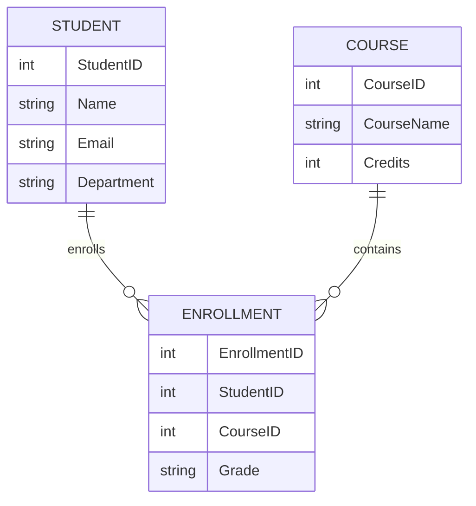

# Practical 2 — Views and Indexing

## Problem Statement

Optimizing a Student Course Management System using views and indexing for faster query performance.

### Entities and Relationships

* Student(StudentID, Name, Email, Department)
* Course(CourseID, CourseName, Credits)
* Enrollment(EnrollmentID, StudentID, CourseID, Grade)

### Relationships

* A student can enroll in multiple courses.
* A course can have multiple students.
* Enrollment resolves the many-to-many relationship between students and courses.
* Views provide simplified reporting across related tables.

---

## Theory

This practical introduces database performance optimization using **views** and **indexes**.

A **view** is a virtual table derived from one or more base tables. Views simplify complex joins, improve readability, and support reporting without duplicating data. Some views are updatable when they directly reference base tables.

**Indexing** improves query performance by allowing the database to quickly locate rows instead of scanning entire tables. Indexes are typically created on columns used in search conditions, joins, and foreign keys.

However, indexing introduces a trade-off: faster reads but slightly slower inserts and updates due to index maintenance.

Understanding when and where to use views and indexes is essential for building scalable database systems.

---

## SQL Overview

Tables used:

* Student
* Course
* Enrollment

Operations performed:

* Created reporting view combining students, courses, and grades.
* Updated and deleted records through an updatable view.
* Created indexes on frequently searched and joined columns.
* Used EXPLAIN ANALYZE to compare query performance before and after indexing.

---

## ER Diagram

---

## Notes

Schema executed using MySQL/PostgreSQL Docker container.
Views were created to simplify reporting of student course data.
Indexes were added on email, student_id, and course_id to improve search and join performance.
Query performance was analyzed using EXPLAIN ANALYZE and documented with screenshots.

---

## 👨‍💻 Maintainer

Maintained by **Himanshu Jadhav**
Second-Year Engineering Student (AI & Data Science)
[GitHub](https://github.com/himanshu-jadhav108) • [LinkedIn](https://www.linkedin.com/in/himanshu-jadhav-328082339) • [Instagram](https://www.instagram.com/himanshu_jadhav_108?igsh=MWYxamppcTBlY3Rl) • [Portfolio](https://himanshu-jadhav-portfolio.vercel.app/)

---
