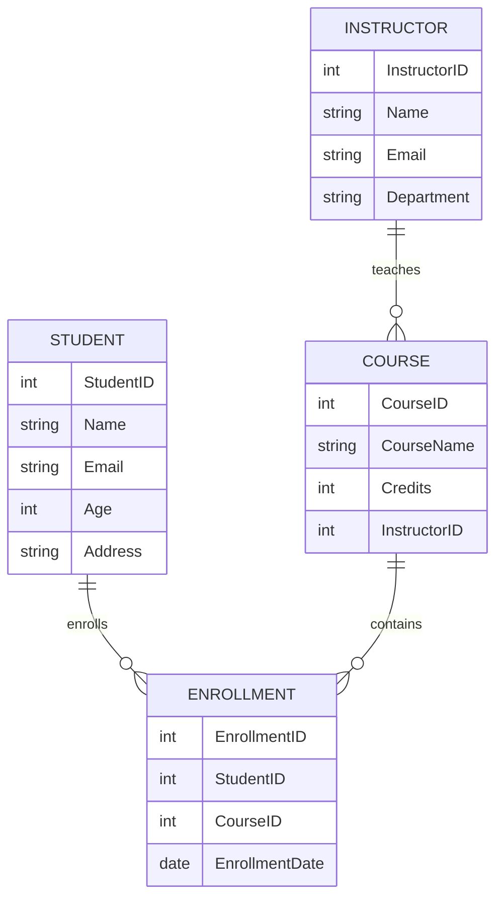

# Practical 3 — SQL Queries with Filters and Sorting

## Problem Statement

Perform advanced querying in a Student Course Management System using filtering, sorting, aggregation, and nested subqueries.

### Entities and Relationships

* Student(StudentID, Name, Email, Age, Address)
* Course(CourseID, CourseName, Credits, InstructorID)
* Instructor(InstructorID, Name, Email, Department)
* Enrollment(EnrollmentID, StudentID, CourseID, EnrollmentDate)

### Relationships

* A student can enroll in multiple courses.
* A course can have multiple students.
* An instructor teaches one or more courses.

---

## Theory

This practical focuses on retrieving meaningful insights from relational databases using SQL filtering and sorting techniques.

Filtering using the **WHERE** clause allows selecting specific records based on conditions such as age, instructor, or course details. Sorting using **ORDER BY** helps organize results alphabetically or numerically for better readability.

Aggregation functions combined with **GROUP BY** enable statistical analysis such as counting students per course and calculating average student age.

Nested subqueries allow complex queries where the result of one query is used inside another. This technique is commonly used in analytics, reporting systems, and recommendation engines.

These concepts are essential for real-world database querying and backend data processing.

---

## SQL Overview

Concepts demonstrated:

* Filtering students above a certain age using **WHERE**
* Filtering courses based on instructor
* Sorting student names alphabetically
* Sorting courses by credits
* Aggregation using **GROUP BY** (student count per course, average age)
* Nested subqueries to retrieve complex filtered results

Example query categories:

* Student filtering queries
* Course sorting queries
* Aggregation queries
* Nested subquery-based analytical queries

---

## ER Diagram

---

## Notes

Schema reused from previous practical.
Queries executed using MySQL Docker container.
Filtering and sorting improve data readability and analysis.
Aggregation provides statistical insights from relational data.
Nested subqueries enable advanced data retrieval scenarios.
ER diagram generated using Mermaid in VS Code.

---

## 👨‍💻 Maintainer

Maintained by **Himanshu Jadhav**
Second-Year Engineering Student (AI & Data Science)

[GitHub](https://github.com/himanshu-jadhav108) • [LinkedIn](https://www.linkedin.com/in/himanshu-jadhav-328082339) • [Instagram](https://www.instagram.com/himanshu_jadhav_108?igsh=MWYxamppcTBlY3Rl) • [Portfolio](https://himanshu-jadhav-portfolio.vercel.app/)

---
