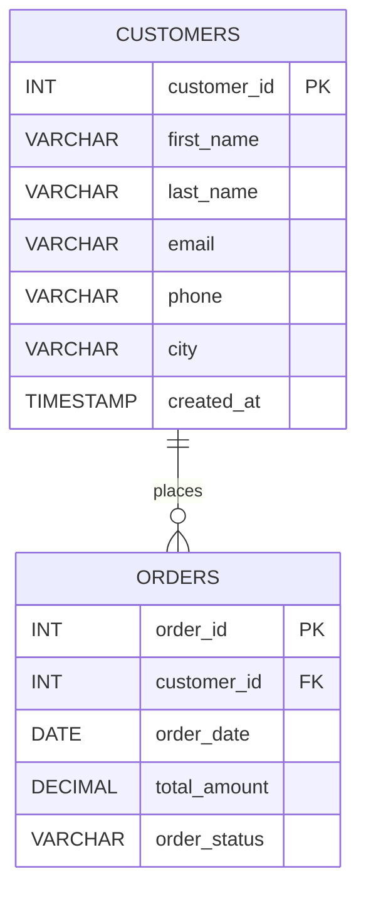

# Practical 4 — Multi-Table Joins

## Problem Statement

In this practical, a **Customer Order Management System** is developed to understand and implement multi-table joins in SQL. The system maintains structured data about customers and their corresponding orders. The primary goal is to retrieve meaningful information by combining data stored across multiple related tables using SQL join operations.

In real-world database systems such as e-commerce platforms, retail billing systems, and service-based applications, data is rarely stored in a single table. Instead, it is distributed across normalized tables to avoid redundancy and maintain data integrity. Retrieving related data requires relational operations such as **INNER JOIN, LEFT JOIN, RIGHT JOIN, and FULL OUTER JOIN**.

This practical focuses on understanding how different join types behave in various scenarios, especially when matching records exist in one table but not the other. The exercise also highlights referential integrity and practical query writing techniques used in enterprise database systems.

---

### Entities and Relationships

#### Entities

**1. Customers**

* customer_id (Primary Key)
* first_name
* last_name
* email (Unique)
* phone
* city
* created_at

**2. Orders**

* order_id (Primary Key)
* customer_id (Foreign Key → Customers.customer_id)
* order_date
* total_amount
* order_status

---

### Relationships

* **One-to-Many Relationship**

  * One customer can place multiple orders.
  * Each order belongs to one customer.
  * Implemented using a foreign key in the `orders` table.

* **Dependency**

  * `orders.customer_id` depends on `customers.customer_id`.
  * Enforces referential integrity.

* **Outer Join Behavior**

  * LEFT JOIN → Shows customers without orders.
  * RIGHT JOIN → Shows orders without matching customers.
  * FULL OUTER JOIN → Combines unmatched records from both sides.

---

## Theory

Relational databases organize data into multiple normalized tables to reduce redundancy and improve consistency. When related information is stored across tables, **joins** are required to retrieve combined datasets.

An **INNER JOIN** returns only matching records between two tables. It is the most commonly used join and ensures that only logically related data is retrieved.

A **LEFT JOIN (LEFT OUTER JOIN)** returns all records from the left table and matching records from the right table. If no match exists, NULL values are returned. This is useful when identifying missing relationships (e.g., customers who have not placed orders).

A **RIGHT JOIN** behaves similarly but prioritizes the right table.

A **FULL OUTER JOIN** retrieves all records from both tables, whether matched or not. Since MySQL does not directly support FULL OUTER JOIN, it is implemented using a UNION of LEFT and RIGHT joins.

Constraints such as **PRIMARY KEY**, **FOREIGN KEY**, **NOT NULL**, and **UNIQUE** ensure data integrity. Indexing improves performance when joining large tables by speeding up lookup operations.

Performance optimization techniques such as `EXPLAIN` help analyze query execution plans to ensure efficient joins.

---

## SQL Overview

This practical includes two primary tables:

* `customers`
* `orders`

Indexes are added on foreign key columns to improve join performance.

The SQL queries demonstrate:

* INNER JOIN (matching records)
* LEFT JOIN (customers without orders)
* RIGHT JOIN (orders without customers)
* FULL OUTER JOIN simulation
* Sorting and filtering
* Aggregation using GROUP BY
* Performance analysis using EXPLAIN

---

# ER Diagram 

---

# Notes

* Schema executed using Docker MySQL container.
* Demonstrated INNER, LEFT, RIGHT, and FULL OUTER JOIN (via UNION).
* Index added on `orders.customer_id` to optimize join performance.
* ER Diagram created using Mermaid in VS Code.
* This practical builds independently but can integrate with previous filtering/sorting practical.

---

# Maintainer Section

Maintained by **Himanshu Jadhav**
Second-Year Engineering Student (AI & Data Science)

[GitHub](https://github.com/himanshu-jadhav108) • [LinkedIn](https://www.linkedin.com/in/himanshu-jadhav-328082339) • [Instagram](https://www.instagram.com/himanshu_jadhav_108?igsh=MWYxamppcTBlY3Rl) • [Portfolio](https://himanshu-jadhav-portfolio.vercel.app/)

---