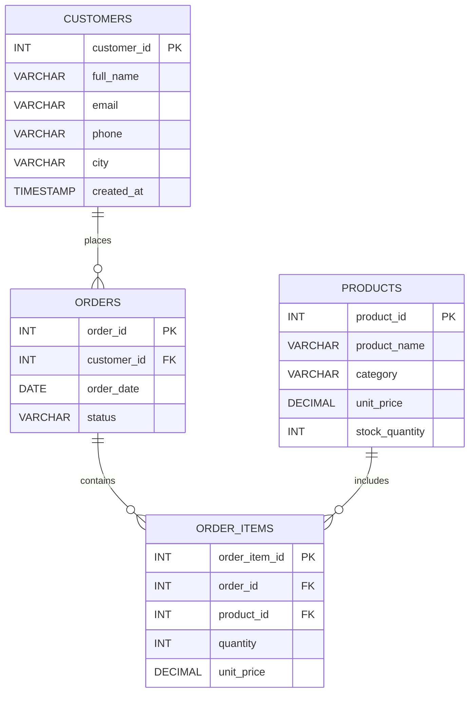

#  **Practical 5 — PL/SQL Procedures and Functions**

#  Problem Statement

In this practical, a **Sales Management System** is designed and implemented using advanced database programming concepts such as stored procedures and functions. The system manages customers, products, orders, and order details while enabling automated data handling through procedural logic inside the database. The focus is to enhance modularity, maintainability, and efficiency by moving business logic into stored routines.

Modern enterprise applications rely heavily on database-level programming to ensure data consistency and performance. Instead of handling logic at the application layer, stored procedures and functions allow secure and optimized execution directly inside the database engine. This reduces redundancy, improves execution speed, and enforces business rules centrally.

This practical explores:

* Creating stored procedures for controlled data insertion
* Creating functions for calculating aggregated results (Total Sales)
* Implementing referential integrity using constraints
* Applying joins, aggregation, and indexing for performance

The system simulates a real-world retail environment where customers place orders, and each order contains multiple products.

---

## Entities and Relationships

### Entities

• **customers**

* customer_id (PK)
* full_name
* email
* phone
* city
* created_at

• **products**

* product_id (PK)
* product_name
* category
* unit_price
* stock_quantity

• **orders**

* order_id (PK)
* customer_id (FK)
* order_date
* status

• **order_items**

* order_item_id (PK)
* order_id (FK)
* product_id (FK)
* quantity
* unit_price

---

## Relationships

• **One-to-Many**

* One customer → Many orders
* One order → Many order_items
* One product → Many order_items

• **Many-to-Many**

* Orders and Products have a many-to-many relationship
* Implemented using the junction table **order_items**

• **Dependencies**

* order_items depends on both orders and products
* orders depends on customers

---

# Theory

Stored procedures are database objects that encapsulate SQL logic and can perform operations such as insertions, updates, or complex validations. They improve security by restricting direct table access and enhance performance by pre-compiling SQL statements.

Functions are similar to procedures but return a single value. They are commonly used for calculations and reusable logic. In this practical, a function is used to calculate total sales by aggregating revenue from order items.

Constraints such as PRIMARY KEY, FOREIGN KEY, NOT NULL, and UNIQUE ensure data integrity and enforce relationships between tables.

Indexes are used to optimize query performance, especially on frequently searched columns such as foreign keys and email fields.

Aggregation functions like SUM() are used to calculate total revenue. Joins are used to retrieve relational data across multiple tables.

Transactions ensure that grouped operations execute atomically, preventing partial data insertion.

Normalization is applied to eliminate redundancy by separating customers, products, and orders into structured tables.

---

# SQL Overview

This system consists of four core tables:

* customers
* products
* orders
* order_items

New additions in this practical:

* Stored procedure: `sp_add_order`
* Stored function: `fn_total_sales`
* Indexes on foreign keys and email
* View for order summary reporting

Queries demonstrate:

* Sales aggregation
* Customer order history
* Revenue calculations
* Performance analysis using EXPLAIN
* Sorting and filtering operations

---

# ER Diagram

---

# Notes

* Executed using Docker MySQL container
* Demonstrated stored procedures and stored functions
* Used indexing for query optimization
* Aggregation and subqueries implemented
* ER diagram created using Mermaid in VS Code
* Independent practical (not extending previous schema)

---

# Maintainer Section

Maintained by **Himanshu Jadhav**
Second-Year Engineering Student (AI & Data Science)

[GitHub](https://github.com/himanshu-jadhav108) • [LinkedIn](https://www.linkedin.com/in/himanshu-jadhav-328082339) • [Instagram](https://www.instagram.com/himanshu_jadhav_108?igsh=MWYxamppcTBlY3Rl) • [Portfolio](https://himanshu-jadhav-portfolio.vercel.app/)

---