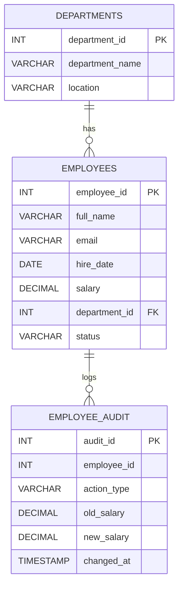

# **Practical 6 — Triggers and Cursors**

# Problem Statement

In this practical, an **Employee Management System** is developed to demonstrate advanced database programming using triggers and cursors in MySQL. The system manages employee records and ensures that every change made to employee data is automatically recorded in an audit table. Additionally, controlled salary updates are performed using cursor-based procedural logic.

In real-world enterprise environments, maintaining data integrity and traceability is critical. Audit logging ensures accountability by tracking all INSERT, UPDATE, and DELETE operations performed on sensitive tables such as employee records. Triggers automate this process at the database level, eliminating reliance on application-side logging.

Cursors enable row-by-row processing of records when business logic requires conditional updates that cannot be efficiently handled using a single SQL statement. In this practical, a cursor is used to iterate through employees in the IT department and apply a salary increment based on defined conditions.

This practical explores:

* AFTER triggers for audit logging
* Stored procedures with cursors
* Conditional salary updates
* Transactional control
* Indexing for performance optimization

---

## Entities and Relationships

### Entities

• **departments**

* department_id (PK)
* department_name
* location

• **employees**

* employee_id (PK)
* full_name
* email (UNIQUE)
* hire_date
* salary
* department_id (FK)
* status

• **employee_audit**

* audit_id (PK)
* employee_id
* action_type
* old_salary
* new_salary
* changed_at

---

## Relationships

• **One-to-Many**

* One department → Many employees

• **Dependencies**

* employees depends on departments
* employee_audit depends logically on employees

• **No Many-to-Many**

* Current design does not require junction tables

---

# Theory

Triggers are database objects that automatically execute in response to specific events such as INSERT, UPDATE, or DELETE operations on a table. They are widely used for enforcing business rules, maintaining derived data, and implementing audit logging. AFTER triggers execute after the modification is committed, making them suitable for logging historical data.

Cursors are control structures that allow row-by-row processing of query results. While SQL is designed for set-based operations, cursors are useful when conditional or sequential logic must be applied to each record individually.

Constraints such as PRIMARY KEY, FOREIGN KEY, UNIQUE, and NOT NULL ensure referential integrity and prevent invalid data entry. Indexes improve performance when filtering or joining large tables, particularly on foreign keys and frequently searched columns.

Transactions ensure atomic execution of multiple statements. If an error occurs during salary processing, changes can be rolled back to maintain consistency.

Normalization is applied by separating departments and employees into distinct tables to avoid redundancy.

---

# SQL Overview

The system consists of three primary tables:

* departments
* employees
* employee_audit

New additions in this practical:

* AFTER INSERT, UPDATE, DELETE triggers on employees
* Stored procedure using a cursor for salary increments
* Index on department_id for performance optimization

The queries demonstrate:

* Automatic audit logging
* Cursor-based conditional salary updates
* Filtering and aggregation
* Join operations
* Performance checks using EXPLAIN

---

# ER Diagram

---

# Notes

* Executed inside Docker MySQL container
* Demonstrated AFTER triggers for INSERT, UPDATE, DELETE
* Implemented cursor-based salary processing
* Used indexing for optimized filtering
* ER diagram created using Mermaid in VS Code
* Independent practical (separate schema)

---

# Maintainer Section

Maintained by **Himanshu Jadhav**
Second-Year Engineering Student (AI & Data Science)

[GitHub](https://github.com/himanshu-jadhav108) • [LinkedIn](https://www.linkedin.com/in/himanshu-jadhav-328082339) • [Instagram](https://www.instagram.com/himanshu_jadhav_108?igsh=MWYxamppcTBlY3Rl) • [Portfolio](https://himanshu-jadhav-portfolio.vercel.app/)

---