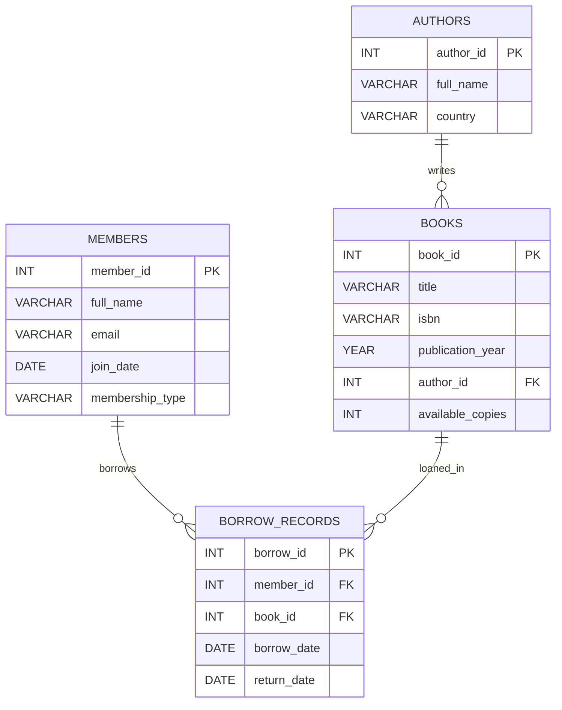

# **Practical 9 — MySQL Database Backup and Recovery**

# Problem Statement

In this practical, a **Library Management System** database is designed and used to demonstrate the process of performing backup and recovery operations in MySQL. The primary objective is to understand how database backups protect against data loss and how recovery mechanisms restore data in case of accidental deletion, corruption, or system failure.

In real-world environments, databases store critical organizational data. Hardware failures, accidental deletions, software bugs, or cyber-attacks can result in severe data loss. Backup and recovery strategies are essential components of database administration (DBA) practices. This practical focuses on creating a structured database, inserting realistic data, performing logical backups using `mysqldump`, and restoring the database to ensure disaster recovery readiness.

The concepts explored include logical backup creation, full database restoration, transactional consistency, and integrity verification after recovery. Additionally, performance verification and data validation queries are executed after restoration to confirm database reliability.

---

## Entities and Relationships

### Entities

• **authors**

* author_id (PK)
* full_name
* country

• **members**

* member_id (PK)
* full_name
* email (UNIQUE)
* join_date
* membership_type

• **books**

* book_id (PK)
* title
* isbn (UNIQUE)
* publication_year
* author_id (FK)
* available_copies

• **borrow_records**

* borrow_id (PK)
* member_id (FK)
* book_id (FK)
* borrow_date
* return_date

---

## Relationships

• **One-to-Many**

* One author → Many books
* One member → Many borrow_records
* One book → Many borrow_records

• **Many-to-Many**

* Members and Books share a many-to-many relationship
* Implemented using the junction table **borrow_records**

• **Dependencies**

* books depends on authors
* borrow_records depends on both members and books

---

# Theory

Database backup is the process of creating a copy of database data to protect against loss. In MySQL, logical backups are commonly created using `mysqldump`, which exports the database schema and data as SQL statements. These backups can later be restored using the MySQL client.

Recovery refers to restoring the database from backup files after data loss or corruption. Recovery ensures data consistency and system reliability.

Constraints such as PRIMARY KEY, FOREIGN KEY, UNIQUE, and NOT NULL maintain integrity even after restoration. Transactions ensure atomicity during operations, and backups taken with transactional support guarantee consistent states.

Indexes improve query performance during validation after recovery. Aggregation and join queries help verify that relationships remain intact.

Normalization is applied to eliminate redundancy by separating authors, books, members, and borrow records into structured tables.

---

# SQL Overview

The Library Management System contains four main tables:

* authors
* members
* books
* borrow_records

This practical does not introduce new tables beyond the core schema but focuses on:

* Creating a consistent schema
* Populating realistic data
* Performing logical backup using mysqldump
* Dropping and restoring the database
* Verifying data integrity after recovery

Queries demonstrate:

* Join validation after restore
* Aggregation checks
* Referential integrity confirmation
* Index usage verification using EXPLAIN

---

# ER Diagram 

---

# Notes

* Executed inside Docker MySQL container
* Logical backup performed using `mysqldump`
* Recovery tested by dropping and restoring database
* Referential integrity validated after restore
* Indexes used for performance verification
* ER diagram created using Mermaid in VS Code
* Independent practical schema

---

# Maintainer Section

Maintained by **Himanshu Jadhav**
Second-Year Engineering Student (AI & Data Science)

[GitHub](https://github.com/himanshu-jadhav108) • [LinkedIn](https://www.linkedin.com/in/himanshu-jadhav-328082339) • [Instagram](https://www.instagram.com/himanshu_jadhav_108?igsh=MWYxamppcTBlY3Rl) • [Portfolio](https://himanshu-jadhav-portfolio.vercel.app/)

---