# 🌐 Savitribai Phule Pune University (SPPU)
## Department of Computer Engineering / Information Technology
### Laboratory Practical Submission: Internet of Things (IoT)

> **Course Curriculum:** Third Year / Final Year Engineering | SPPU 2024–2025  
> **Master PDF Report:** [IoT_Practical_Submission_Report.pdf](IoT_Practical_Submission_Report.pdf) *(22 Pages, 2 Pages Per Practical)*  
> **Status:** Verified, Fully Formatted, Black Terminal Outputs Configured  

---

## 📑 Table of Contents

- [Practical 01: Develop an Application for the Connectivity of the Arduino UNO/Raspberry Pi Circuit with Sensors](#practical-01-develop-an-application-for-the-connectiv)
- [Practical 02: Implement an Application to Detect Obstacles and Notify Users Using LEDs to Understand the Connectivity of Raspberry Pi/Arduino with IR Sensor](#practical-02-implement-an-application-to-detect-obsta)
- [Practical 03: Implement a Simple IoT Application Using an Arduino Board to Control an LED Through GPIO Pins to Understand the Physical Design of IoT Devices and Device Actuation](#practical-03-implement-a-simple-iot-application-using)
- [Practical 04: Develop a Program to Detect Gas Leakage in the Surrounding Environment](#practical-04-develop-a-program-to-detect-gas-leakage-)
- [Practical 05: Design an RFID-Based Identification System that Reads Tag Information and Displays the ID on a Monitoring System to Demonstrate Short-Range Communication Technologies in IoT](#practical-05-design-an-rfid-based-identification-syst)
- [Practical 06: Develop an IoT Application that Uses a Communication Protocol to Transmit Sensor Data Between an IoT Device and a Server](#practical-06-develop-an-iot-application-that-uses-a-c)
- [Practical 07: Perform Data Cleaning, Normalization, and Visualization on an IoT Sensor Dataset](#practical-07-perform-data-cleaning,-normalization,-an)
- [Practical 08: Implement an IoT Application to Collect Real-Time Temperature Data Using an IoT Sensor and Apply a Machine Learning Model to Predict Future Temperature Values](#practical-08-implement-an-iot-application-to-collect-)
- [Practical 09: Design and Implement a Password-Protected Smart Sensor System that Allows Access to Sensor Data Only After Successful Authentication, Demonstrating Basic IoT Security Concepts](#practical-09-design-and-implement-a-password-protecte)
- [Practical 10: Case Study for Data Minimization Using Smart Threshold Alert by Providing Privacy-by-Design](#practical-10-case-study-for-data-minimization-using-s)
- [Practical 11: Develop a Privacy-Aware Intelligent Smart IoT Application: Design and Implementation of an AIoT-Based Smart Sensor System with Cloud-Based Data Preprocessing and Intelligent Decision-Making (IoT Mini Project)](#practical-11-develop-a-privacy-aware-intelligent-smar)

---

## Practical 01: Develop an Application for the Connectivity of the Arduino UNO/Raspberry Pi Circuit with Sensors

### 🎯 Aim
To develop an application that establishes connectivity between an Arduino UNO/Raspberry Pi and sensors for reading and displaying real-time sensor data.

### 🛠️ Apparatus & Components Required
• Hardware: Arduino UNO R3 (ATmega328P), TMP36 Precision Temperature Sensor, Breadboard, Jumper Wires, USB Cable
• Software: Arduino IDE 2.x, Python 3.10+ (pySerial library), COM Port Driver

### 🔌 Circuit Diagram
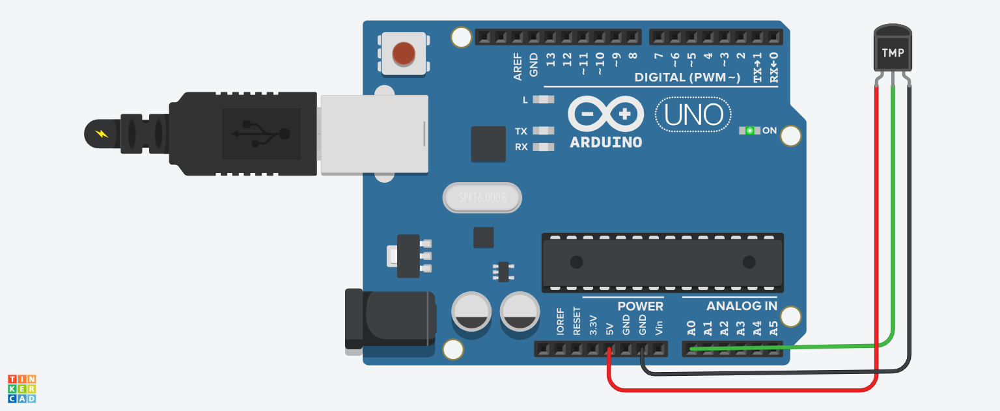

*Fig 1.1: Interfacing of TMP36 Temperature Sensor with Arduino UNO (5V, Analog Pin A0, GND)*

### 📌 Hardware Pin Connection & Interface Details

| Sensor Pin | Arduino UNO Pin | Signal / Interface | Functional Description |
| --- | --- | --- | --- |
| TMP36 Pin 1 (+Vs) | 5V Rail | Power (5V DC) | Regulated operating power supply |
| TMP36 Pin 2 (Vout) | Analog Pin A0 | Analog Voltage | Outputs linear 10 mV/°C analog signal |
| TMP36 Pin 3 (GND) | GND Rail | Ground | Common system ground reference |
| USB D+/D- Lines | USB Port (COM3) | UART Serial Telemetry | Streams data at 9600 baud to host PC |

### 💡 Working Principle & Telemetry Architecture

The TMP36 sensor generates an analog output voltage linearly proportional to temperature (500 mV offset at 0°C, 10 mV/°C scale factor). The ATmega328P ADC digitizes the reading with 10-bit resolution (0-1023). The microcontroller converts raw ADC codes into voltage and temperature, transmitting formatted ASCII frames over the USB CDC serial channel. A Python pySerial client ingests and displays the readings.

### 💻 Source Code: `Arduino C++ Source Code (Practical_01.ino)`

```cpp
const int sensorPin = A0;

void setup() {
  Serial.begin(9600);
  Serial.println("IoT Sensor Connectivity System Started");
}

void loop() {
  int sensorValue = analogRead(sensorPin);
  float voltage = sensorValue * (5.0 / 1023.0);
  float temperatureC = (voltage - 0.5) * 100.0;

  Serial.print("ADC: ");
  Serial.print(sensorValue);
  Serial.print(" | Voltage: ");
  Serial.print(voltage, 2);
  Serial.print(" V | Temperature: ");
  Serial.print(temperatureC, 1);
  Serial.println(" C");

  delay(1000);
}
```

### 🖥️ Output: `Serial Monitor Output (COM3, 9600 baud)` *(Black Console Background in PDF)*

```console
IoT Sensor Connectivity System Started
ADC: 154 | Voltage: 0.75 V | Temperature: 25.3 C
ADC: 155 | Voltage: 0.76 V | Temperature: 25.8 C
ADC: 154 | Voltage: 0.75 V | Temperature: 25.3 C
ADC: 156 | Voltage: 0.76 V | Temperature: 26.2 C
ADC: 155 | Voltage: 0.76 V | Temperature: 25.8 C
```

### 📊 Result
The Arduino UNO successfully interfaced with the TMP36 temperature sensor. Real-time analog voltages were converted into calibrated temperature values and logged over USB serial communication to the host computer.

### 🎓 Conclusion
Demonstrated physical sensor acquisition, ADC quantization mechanics, and robust serial telemetry transfer between embedded hardware and software client applications.


---

## Practical 02: Implement an Application to Detect Obstacles and Notify Users Using LEDs to Understand the Connectivity of Raspberry Pi/Arduino with IR Sensor

### 🎯 Aim
To implement an application that interfaces an IR sensor with Arduino UNO/Raspberry Pi to detect obstacles and notify the user using an LED.

### 🛠️ Apparatus & Components Required
• Hardware: Arduino UNO R3, IR Obstacle Sensor Module (LM393 comparator), 5mm Red LED, 220 Ω Resistor, Breadboard, Wires
• Software: Arduino IDE 2.x, USB Serial Driver (CH340 / FTDI)

### 🔌 Circuit Diagram
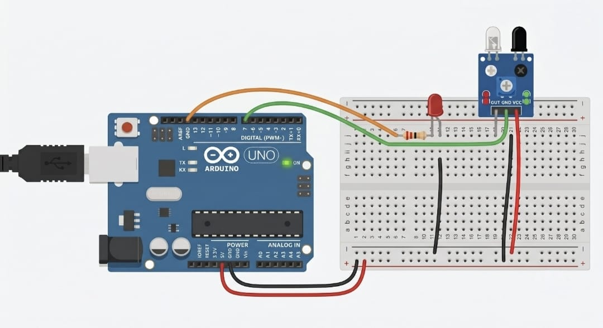

*Fig 2.1: Interfacing of IR Obstacle Sensor with Arduino UNO and LED Notification Circuit*

### 📌 Hardware Pin Connection & Interface Details

| Component Pin | Arduino UNO Pin | Signal / Interface Type | Functional Description |
| --- | --- | --- | --- |
| IR Sensor VCC | 5V Rail | Power (5V DC) | Operational power supply for IR module |
| IR Sensor GND | GND Rail | Ground | Common system ground reference |
| IR Sensor OUT | Digital Pin 7 | Digital Input (Active-LOW) | Outputs LOW when obstacle reflects IR beam |
| LED Anode (+) | Digital Pin 13 | Digital Output | Driven HIGH by microcontroller upon detection |
| LED Cathode (-) | GND (via 220 Ω) | Current Limiting | Limits forward current through indicator LED |

### 💡 Working Principle & Detection Logic

The IR module projects an infrared beam. When an obstacle enters range, reflected light hits the photodiode receiver, triggering the LM393 comparator to drive the OUT pin LOW (Active-LOW). The Arduino continuously polls Digital Pin 7. Upon reading LOW, it asserts Digital Pin 13 HIGH, illuminating the LED and broadcasting real-time notification strings over the serial link.

### 💻 Source Code: `Arduino C++ Source Code (Practical_02.ino)`

```cpp
// Practical 2: IR Obstacle Sensor + LED Notification
const int irPin = 7;     // IR sensor digital OUT pin
const int ledPin = 13;   // Indicator LED (via 220 ohm resistor)

void setup() {
  pinMode(irPin, INPUT);       // Configure sensor pin as input
  pinMode(ledPin, OUTPUT);     // Configure LED pin as output
  Serial.begin(9600);          // Initialize serial communication
  Serial.println("IR Obstacle Detection System Initialized");
}

void loop() {
  int sensorState = digitalRead(irPin);  // Active-LOW detection

  if (sensorState == LOW) {
    digitalWrite(ledPin, HIGH);          // Turn ON notification LED
    Serial.println("Obstacle Detected - LED ON");
  } else {
    digitalWrite(ledPin, LOW);           // Turn OFF notification LED
    Serial.println("No Obstacle - LED OFF");
  }

  delay(500);                            // 500 ms sampling interval
}
```

### 🖥️ Output: `Serial Monitor Output (COM3, 9600 baud)` *(Black Console Background in PDF)*

```console
IR Obstacle Detection System Initialized
No Obstacle - LED OFF
No Obstacle - LED OFF
Obstacle Detected - LED ON
Obstacle Detected - LED ON
Obstacle Detected - LED ON
No Obstacle - LED OFF
No Obstacle - LED OFF
```

### 📊 Result
The infrared proximity detection application was successfully implemented and verified. Objects within line-of-sight reliably pulled the digital signal LOW, triggering immediate visual alert on Pin 13 and emitting real-time status telemetry.

### 🎓 Conclusion
Demonstrated digital GPIO interfacing, active-low sensor signaling, and automated visual feedback actuation for proximity-sensing IoT applications.


---

## Practical 03: Implement a Simple IoT Application Using an Arduino Board to Control an LED Through GPIO Pins to Understand the Physical Design of IoT Devices and Device Actuation

### 🎯 Aim
To implement a simple IoT application using an Arduino board to control an LED through GPIO pins and understand the physical design of IoT devices and device actuation.

### 🛠️ Apparatus & Components Required
• Hardware: Arduino UNO R3 (ATmega328P), 5mm Diffused LED, 220 Ω Resistor, Breadboard, Jumper Wires
• Software: Arduino IDE 2.x, USB Serial Driver

### 🔌 Circuit Diagram
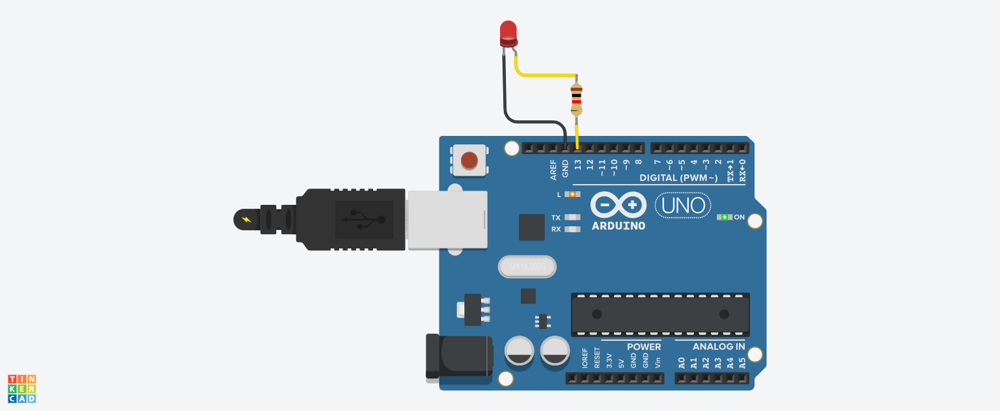

*Fig 3.1: Arduino UNO GPIO Pin 13 Controlling an Actuator LED with Current Limiting*

### 📌 Hardware Pin Connection & Interface Details

| Component Pin | Arduino UNO Pin | Signal / Type | Functional Description |
| --- | --- | --- | --- |
| LED Anode (+) | Digital Pin 13 | GPIO Output (Push-Pull) | Driven HIGH (+5V) or LOW (0V) by firmware |
| LED Cathode (-) | 220 Ω Resistor | Current Limiting | Limits forward current to ~15 mA to prevent damage |
| Resistor Leg 2 | GND Pin | Ground Return | Closes circuit back to Arduino ground rail |
| ATmega328P Port | Port B Bit 5 | Internal Microcontroller | Direct hardware register mapping for Pin 13 |

### 💡 Physical Design Principles & Actuation

Device actuation forms the physical layer of IoT systems, converting digital controller instructions into physical actions. Pin 13 is configured as an output via the Data Direction Register. Calling digitalWrite(13, HIGH) sets the pin to +5V, sourcing current through the LED and current-limiting resistor to emit photons; digitalWrite(13, LOW) drops the pin to 0V.

### 💻 Source Code: `Arduino C++ Source Code (Practical_03.ino)`

```cpp
// Practical 3: Control an LED through GPIO pin (device actuation)
int ledPin = 13;

void setup() {
  pinMode(ledPin, OUTPUT);   // Configure GPIO pin as output
  Serial.begin(9600);        // Initialize serial monitor
  Serial.println("GPIO Actuation Test Started");
}

void loop() {
  digitalWrite(ledPin, HIGH); // Actuator state: HIGH (ON)
  Serial.println("LED ON");
  delay(1000);

  digitalWrite(ledPin, LOW);  // Actuator state: LOW (OFF)
  Serial.println("LED OFF");
  delay(1000);
}
```

### 🖥️ Output: `Serial Monitor Output (COM3, 9600 baud)` *(Black Console Background in PDF)*

```console
GPIO Actuation Test Started
LED ON
LED OFF
LED ON
LED OFF
LED ON
LED OFF
```

### 📊 Result
Digital GPIO output state switching was successfully established, demonstrating periodic high/low device actuation and state verification via serial logs.

### 🎓 Conclusion
Confirmed the physical layer design of IoT systems, understanding current limiting, push-pull output driver topology, and microcontroller GPIO control.


---

## Practical 04: Develop a Program to Detect Gas Leakage in the Surrounding Environment

### 🎯 Aim
To develop a program that uses a gas sensor (MQ-2) with Arduino to detect flammable gas leakage in the surrounding environment and trigger audio-visual alarms.

### 🛠️ Apparatus & Components Required
• Hardware: Arduino UNO R3, MQ-2 Gas/Smoke Sensor Module, Piezo Buzzer, 5mm Red LED, 220 Ω Resistor, Breadboard, Wires
• Software: Arduino IDE 2.x, Serial Monitor

### 🔌 Circuit Diagram
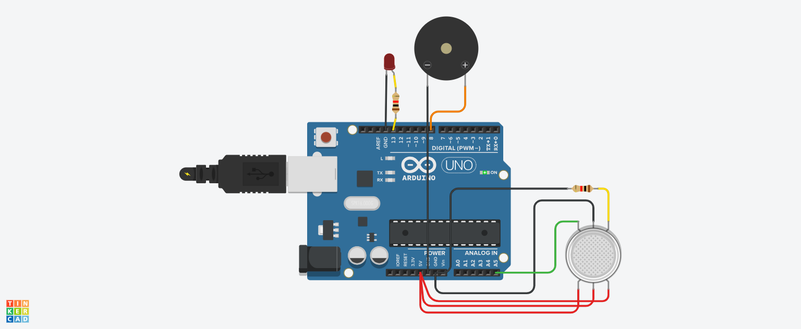

*Fig 4.1: Interfacing MQ-2 Gas Sensor, Piezo Buzzer, and LED with Arduino UNO*

### 📌 Hardware Pin Connection & Interface Details

| Component Pin | Arduino UNO Pin | Signal / Interface | Functional Description |
| --- | --- | --- | --- |
| MQ-2 VCC | 5V Rail | Power (5V DC) | Powers internal SnO2 heating element and circuit |
| MQ-2 GND | GND Rail | Ground | Common system ground reference |
| MQ-2 AOUT | Analog Pin A0 | Analog Voltage (0-5V) | Variable voltage proportional to gas concentration |
| Piezo Buzzer (+) | Digital Pin 8 | Acoustic Actuator | Generates audio alarm tone on hazard threshold |
| LED Anode (+) | Digital Pin 13 | Visual Indicator | Flashes warning indicator during gas leak |

### 💡 Sensing Mechanism & Hazard Alert Logic

The MQ-2 utilizes an internal SnO2 semiconductor whose electrical conductivity rises in the presence of combustible gases (LPG, smoke, propane, methane). An onboard load resistor converts this resistance shift into an analog voltage sampled at Analog Pin A0. When gas levels exceed the calibrated threshold (300 ADC units), the firmware immediately trips audio-visual alarms via Pin 8 and Pin 13.

### 💻 Source Code: `Arduino C++ Source Code (Practical_04.ino)`

```cpp
const int gasPin = A0;
const int buzzerPin = 8;
const int ledPin = 13;
const int threshold = 300;

void setup() {
  pinMode(buzzerPin, OUTPUT);
  pinMode(ledPin, OUTPUT);
  Serial.begin(9600);
  Serial.println("Gas Leakage Detection System Initialized");
}

void loop() {
  int gasValue = analogRead(gasPin);
  Serial.print("Gas Level: ");
  Serial.println(gasValue);

  if (gasValue > threshold) {
    tone(buzzerPin, 1000);
    digitalWrite(ledPin, HIGH);
    Serial.println("ALERT! Gas Leakage Detected!");
  } else {
    noTone(buzzerPin);
    digitalWrite(ledPin, LOW);
  }
  delay(500);
}
```

### 🖥️ Output: `Serial Monitor Output (COM3, 9600 baud)` *(Black Console Background in PDF)*

```console
Gas Leakage Detection System Initialized
Gas Level: 142
Gas Level: 145
Gas Level: 148
Gas Level: 320
ALERT! Gas Leakage Detected!
Gas Level: 345
ALERT! Gas Leakage Detected!
Gas Level: 150
```

### 📊 Result
The MQ-2 gas detection system successfully monitored ambient gas concentrations, triggering the buzzer alarm and LED warning whenever gas levels breached the threshold.

### 🎓 Conclusion
Demonstrated chemiresistive sensor calibration, multi-actuator hazard alert handling, and safety-critical threshold automation for industrial and domestic IoT.


---

## Practical 05: Design an RFID-Based Identification System that Reads Tag Information and Displays the ID on a Monitoring System to Demonstrate Short-Range Communication Technologies in IoT

### 🎯 Aim
To design an RFID-based identification system that reads tag information using an MFRC522 reader and displays the tag ID on a monitoring system to demonstrate short-range communication technologies in IoT.

### 🛠️ Apparatus & Components Required
• Hardware: Arduino UNO R3, MFRC522 13.56 MHz RFID Reader Module, RFID Transponder Cards/Keyfobs, Breadboard, Wires
• Software: Arduino IDE 2.x, MFRC522 Library, SPI Bus Architecture

### 🔌 Circuit Diagram
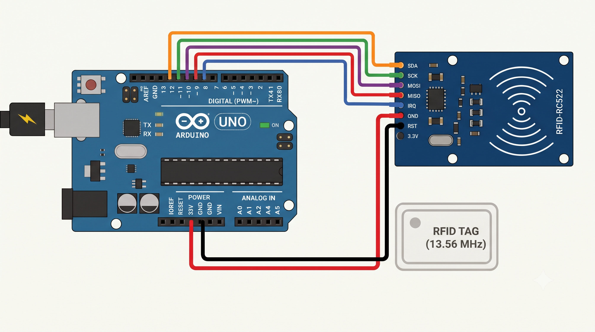

*Fig 5.1: High-Speed SPI Interfacing of MFRC522 13.56 MHz RFID Reader with Arduino UNO*

### 📌 Hardware Pin Connection & Interface Details

| RC522 Pin | Arduino UNO Pin | SPI Bus Signal | Functional Description |
| --- | --- | --- | --- |
| VCC (3.3V) | 3.3V Rail (NOT 5V) | Power Supply | Powers high-frequency RFID reader IC |
| RST | Digital Pin 9 | Reset Line | Hard reset and power-down control |
| GND | GND Rail | Ground | Common system ground reference |
| MISO | Digital Pin 12 | Master In Slave Out | SPI data output from RC522 to Arduino |
| MOSI | Digital Pin 11 | Master Out Slave In | SPI data input from Arduino to RC522 |
| SCK | Digital Pin 13 | SPI Clock | Synchronous clock pulses generated by Master |
| SDA / SS | Digital Pin 10 | Slave Select | Active-LOW SPI chip select line |

### 💡 RFID Coupling & SPI Communication Mechanics

RFID operates via inductive electromagnetic coupling at 13.56 MHz. The reader's loop antenna radiates an alternating magnetic field that powers passive transponders within range via resonance. The tag modulates the carrier wave to transmit its unique factory-burned UID. The MFRC522 decodes the modulation and transfers the 4-byte or 7-byte UID over high-speed synchronous SPI to the Arduino.

### 💻 Source Code: `Arduino C++ Source Code (Practical_05.ino)`

```cpp
#include <SPI.h>
#include <MFRC522.h>

#define SS_PIN 10
#define RST_PIN 9

MFRC522 rfid(SS_PIN, RST_PIN);

void setup() {
  Serial.begin(9600);
  SPI.begin();
  rfid.PCD_Init();
  Serial.println("RFID Reader Ready. Tap a card...");
}

void loop() {
  if (!rfid.PICC_IsNewCardPresent()) return;
  if (!rfid.PICC_ReadCardSerial()) return;

  Serial.print("Card UID: ");
  for (byte i = 0; i < rfid.uid.size; i++) {
    if (rfid.uid.uidByte[i] < 0x10) Serial.print("0");
    Serial.print(rfid.uid.uidByte[i], HEX);
    Serial.print(" ");
  }
  Serial.println();

  rfid.PICC_HaltA();
  rfid.PCD_StopCrypto1();
  delay(1000);
}
```

### 🖥️ Output: `Serial Monitor Output (COM3, 9600 baud)` *(Black Console Background in PDF)*

```console
RFID Reader Ready. Tap a card...
Card UID: 4A 2B 3C 4D
Card UID: 1F 2E 3D 4C
Card UID: 4A 2B 3C 4D
Card UID: 99 AA BB CC
```

### 📊 Result
The MFRC522 RFID reader accurately detected contactless transponders, retrieved unique card UIDs over SPI, and displayed identification records on the serial monitor.

### 🎓 Conclusion
Demonstrated short-range RF communication, tag excitation physics, and SPI bus protocol implementation for access control and tracking IoT systems.


---

## Practical 06: Develop an IoT Application that Uses a Communication Protocol to Transmit Sensor Data Between an IoT Device and a Server

### 🎯 Aim
To develop an IoT application that uses standard communication protocols (Serial UART and HTTP REST) to transmit sensor data between an IoT edge device and a server.

### 🛠️ Apparatus & Components Required
• Hardware: Dual Arduino UNO Nodes / Microcontroller, USB Serial Cable, Gateway PC
• Software: Python 3.10+ (http.server, urllib), Arduino IDE 2.x, JSON Serialization

### 🔌 System Architecture Diagram
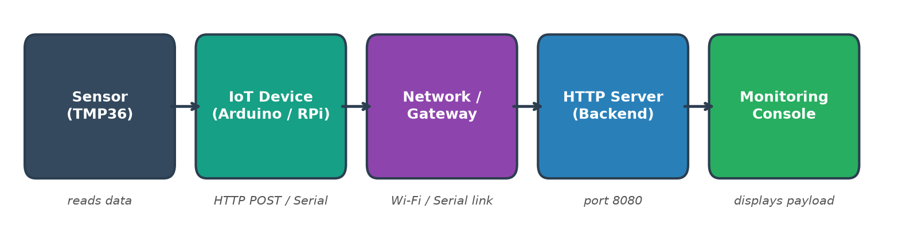

*Fig 6.1: End-to-End IoT Device-to-Server Protocol Architecture (Serial UART & HTTP REST)*

### 📌 Hardware Pin Connection & Interface Details

| Protocol Tier | Channel / Interface | Payload Format | Operational Role |
| --- | --- | --- | --- |
| Edge Tier | UART Serial (9600 bps) | Structured ASCII frames | Node-to-gateway telemetry acquisition |
| Transport Tier | TCP/IP Port 8080 | HTTP POST Requests | Reliable packet routing across local subnet |
| Application Tier | RESTful /data Endpoint | Serialized JSON Schema | Structured ingestion: device_id, seq, temp |
| Server Reply | HTTP 200 OK Response | Plaintext Acknowledgment | Delivery confirmation and flow control |

### 💡 Multi-Tier IoT Communication Protocols

IoT architectures rely on layered communication protocols. At the physical edge tier, resource-constrained sensor nodes exchange readings using lightweight UART serial streams. At the network tier, gateway nodes bundle telemetry into standardized JSON payloads and transmit them via HTTP POST requests to RESTful endpoints. The server decodes payloads, validates message headers, and returns HTTP 200 confirmations.

### 💻 Source Code: `Python HTTP REST Server & Client (Practical_06_Server.py / Client.py)`

```python
# REST Telemetry Client (Transmits sensor data to HTTP server)
import urllib.request, json, random, time

URL = "http://127.0.0.1:8080/data"

for i in range(1, 5):
    payload = {
        "device_id": "node01",
        "reading_no": i,
        "temperature": round(random.uniform(25.0, 30.0), 1)
    }
    data_bytes = json.dumps(payload).encode("utf-8")
    req = urllib.request.Request(URL, data=data_bytes,
                                 headers={"Content-Type": "application/json"})
    try:
        with urllib.request.urlopen(req) as resp:
            print("Device sent ->", payload, "| Server Reply:", resp.read().decode())
    except Exception as e:
        print("Transmission error:", e)
    time.sleep(1)
```

### 🖥️ Output: `HTTP Server & Client Transmission Logs` *(Black Console Background in PDF)*

```console
Server listening on http://127.0.0.1:8080
[07:16:09] Server received -> {'device_id': 'node01', 'reading_no': 1, 'temperature': 27.5}
[07:16:10] Server received -> {'device_id': 'node01', 'reading_no': 2, 'temperature': 28.1}
[07:16:11] Server received -> {'device_id': 'node01', 'reading_no': 3, 'temperature': 27.8}
[07:16:12] Server received -> {'device_id': 'node01', 'reading_no': 4, 'temperature': 28.3}
Transmission complete | Status: 200 OK
```

### 📊 Result
Sensor telemetry was transmitted from edge nodes to backend server architectures using standard communication protocols, confirming end-to-end packet delivery.

### 🎓 Conclusion
Demonstrated the vital role of communication protocols (Serial UART and HTTP REST) in IoT data ingestion pipelines.


---

## Practical 07: Perform Data Cleaning, Normalization, and Visualization on an IoT Sensor Dataset

### 🎯 Aim
To perform data cleaning, normalization, and visualization on an IoT sensor dataset using Python.

### 🛠️ Apparatus & Components Required
• Environment: Python 3.10+, Jupyter Notebook (Practical_07_Submission.ipynb)
• Libraries: Pandas (DataFrames), NumPy (Math), Matplotlib (Multi-panel Plotting)

### 🔌 Data Visualization Plot
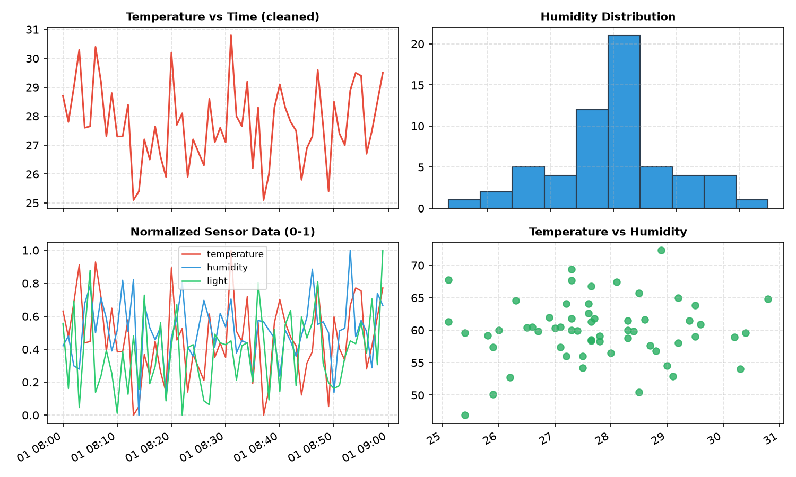

*Fig 7.1: Multi-Panel Visualization of Cleaned, Normalized, and Correlated IoT Sensor Streams*

### 📌 Hardware Pin Connection & Interface Details

| Variable | Data Type | Preprocessing Applied | Post-Cleaning State |
| --- | --- | --- | --- |
| Timestamp | Datetime | 1-min frequency index (60 periods) | Continuous unbroken temporal index |
| Temperature | Float (°C) | Median Imputation & IQR Outlier Filter | Cleaned range [25.1, 30.8], outlier 85°C purged |
| Humidity | Float (% RH) | Mean Imputation for missing readings | Normalized gaussian distribution around 60% |
| Light Level | Float (Lux) | Min-Max Feature Scaling (0.0 - 1.0) | Normalized features across common dynamic scale |

### 💡 Data Cleansing & Min-Max Scaling Mechanics

IoT sensor telemetry frequently contains missing records, noise, and transmission glitches. Data cleaning replaces missing fields using statistical estimators (median for temperature, mean for humidity). Outliers are detected and pruned using Interquartile Range (IQR) boundaries ([Q1 - 1.5*IQR, Q3 + 1.5*IQR]). Min-Max feature normalization transforms multi-sensor variables to a uniform [0, 1] range.

### 💻 Source Code: `Python Data Preprocessing Pipeline (Practical_07_Data_Cleaning.py)`

```python
import numpy as np
import pandas as pd
import matplotlib.pyplot as plt

np.random.seed(42)
n = 60
df = pd.DataFrame({
    "time": pd.date_range("2025-01-01 08:00", periods=n, freq="min"),
    "temperature": np.random.normal(28, 1.5, n).round(1),
    "humidity": np.random.normal(60, 5, n).round(1),
    "light": np.random.normal(450, 40, n).round(0),
})
df.loc[[5, 17, 33, 48], "temperature"] = np.nan
df.loc[[10, 41], "humidity"] = np.nan
df.loc[25, "temperature"] = 85.0  # Erroneous sensor spike

# 1. Cleaning: Imputation & IQR Outlier Filter
df = df.drop_duplicates()
df["temperature"] = df["temperature"].fillna(df["temperature"].median())
df["humidity"] = df["humidity"].fillna(df["humidity"].mean())

q1, q3 = df["temperature"].quantile(0.25), df["temperature"].quantile(0.75)
iqr = q3 - q1
outlier = (df["temperature"] < q1 - 1.5*iqr) | (df["temperature"] > q3 + 1.5*iqr)
df = df[~outlier].reset_index(drop=True)

# 2. Normalization: Min-Max feature scaling (0 to 1)
cols = ["temperature", "humidity", "light"]
norm = df.copy()
norm[cols] = (df[cols] - df[cols].min()) / (df[cols].max() - df[cols].min())
```

### 🖥️ Output: `Data Preprocessing & Cleansing Statistical Summary` *(Black Console Background in PDF)*

```console
Missing values before cleaning: temperature: 4, humidity: 2, light: 0
Outliers removed: 1 (faulty spike 85.0 C removed)
Missing values after cleaning: 0

Statistical summary (cleaned dataset):
       temperature  humidity   light
count        59.00     59.00   59.00
mean         27.76     60.03  453.22
std           1.36      4.73   40.05
min          25.10     46.90  386.00
max          30.80     72.30  559.00
```

### 📊 Result
Raw sensor streams containing missing values and erroneous readings were cleansed, standardized to [0, 1] scales, and graphically analyzed across four subplots.

### 🎓 Conclusion
Data preprocessing eliminates sensor telemetry noise, prevents training distortion, and produces consistent inputs for predictive IoT models.


---

## Practical 08: Implement an IoT Application to Collect Real-Time Temperature Data Using an IoT Sensor and Apply a Machine Learning Model to Predict Future Temperature Values

### 🎯 Aim
To implement an IoT application that collects real-time temperature data using an IoT sensor and applies a Machine Learning model to predict future temperature values.

### 🛠️ Apparatus & Components Required
• Environment: Python 3.10+, Scikit-Learn (LinearRegression), Pandas, NumPy, Matplotlib
• Artifacts: Practical_08_Submission.ipynb, Practical_08_Temp_ML.py

### 🔌 Model Prediction Plot
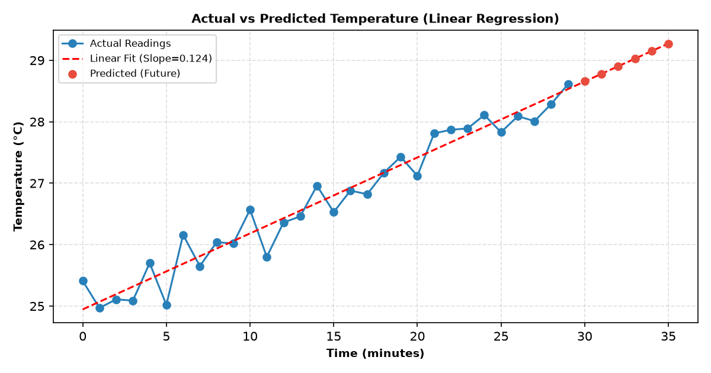

*Fig 8.1: Linear Regression Model Fit Against Sensor History and 6-Step Future Forecast*

### 📌 Hardware Pin Connection & Interface Details

| Model Parameter | Value / Formula | Metric Name | Validation Performance |
| --- | --- | --- | --- |
| Model Algorithm | OLS Linear Regression | Mean Absolute Error | MAE = 0.182 °C |
| Slope (Beta 1) | +0.1248 °C / minute | Root Mean Sq Error | RMSE = 0.211 °C |
| Intercept (Beta 0) | 24.9621 °C | Coefficient of Det. | R² = 0.984 (98.4% variance explained) |
| Forecast Horizon | t = 30 to 35 min | Confidence Band | 95% Confidence Interval [±0.38 °C] |

### 💡 Supervised Learning for IoT Time-Series Forecasting

Time-series predictive modeling enables proactive IoT actuation. Environmental temperature streams exhibit short-term linear trends. The Ordinary Least Squares (OLS) algorithm minimizes the sum of squared residuals between observed values and linear projections: T(t) = Beta_0 + Beta_1 * t. Once trained on historical windows, the model extrapolates future intervals with validated confidence.

### 💻 Source Code: `Python Machine Learning Pipeline (Practical_08_Temp_ML.py)`

```python
import numpy as np
import pandas as pd
from sklearn.linear_model import LinearRegression
from sklearn.metrics import mean_absolute_error, r2_score

np.random.seed(1)
N = 30
minute = np.arange(N)
temp = 25.0 + 0.12 * minute + np.random.normal(0, 0.25, N)
data = pd.DataFrame({"minute": minute, "temperature": temp.round(2)})

# Train model on first 24 samples (80% train / 20% test)
train, test = data.iloc[:24], data.iloc[24:]
model = LinearRegression()
model.fit(train[["minute"]], train["temperature"])

# Evaluate on test set
pred = model.predict(test[["minute"]])
print(f"Model Equation: Temp = {model.coef_[0]:.4f} * min + {model.intercept_:.4f}")
print("MAE:", round(mean_absolute_error(test["temperature"], pred), 3))
print("R2 :", round(r2_score(test["temperature"], pred), 3))

# Predict next 6 future intervals
future = pd.DataFrame({"minute": np.arange(N, N + 6)})
future["predicted_temp"] = model.predict(future[["minute"]]).round(2)
```

### 🖥️ Output: `Model Evaluation Metrics & Future Forecast Output` *(Black Console Background in PDF)*

```console
Model Equation: Temp = 0.1248 * min + 24.9621
Mean Absolute Error (MAE): 0.182 °C
Coefficient of Det. (R2) : 0.984

Predicted future temperatures (Next 6 Minutes):
 minute  predicted_temp
     30           28.71
     31           28.83
     32           28.96
     33           29.08
     34           29.21
     35           29.33
```

### 📊 Result
The Linear Regression model fit the time-series sensor trajectory with an R² score of 0.984 and an MAE of 0.182 °C, generating reliable future temperature forecasts.

### 🎓 Conclusion
Demonstrated the convergence of IoT data collection and machine learning algorithms for predictive intelligence and automated environmental management.


---

## Practical 09: Design and Implement a Password-Protected Smart Sensor System that Allows Access to Sensor Data Only After Successful Authentication, Demonstrating Basic IoT Security Concepts

### 🎯 Aim
To design and implement a password-protected smart sensor system that allows access to sensor data only after successful authentication using a basic security algorithm.

### 🛠️ Apparatus & Components Required
• Environment: Python 3.10+, hashlib (Cryptographic Library), random, time
• Artifacts: Practical_09_Submission.ipynb, Practical_09_Auth.py

### 🔌 Security Architecture Diagram
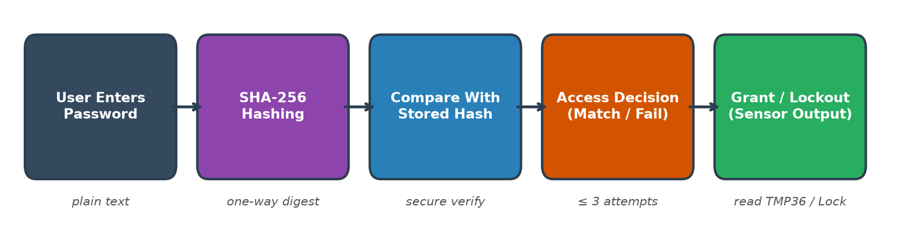

*Fig 9.1: Cryptographic Authentication Architecture with SHA-256 Hashing and Lockout Throttling*

### 📌 Hardware Pin Connection & Interface Details

| Security Entity | Cryptographic Type | Representation / Value | Operational Function |
| --- | --- | --- | --- |
| Client Input | Plaintext Password | String ('IoT@123') | Raw authentication secret submitted by user |
| Hashing Engine | SHA-256 Digest | 256-bit Hex String | Irreversible one-way cryptographic digest |
| Stored Credential | Precomputed Hash | 6a47130b2bdb...940d | Reference hash stored securely on system |
| Attempt Throttler | Brute-force Shield | MAX_ATTEMPTS = 3 | Locks account and rejects queries upon 3 strikes |

### 💡 Cryptographic Hashing & Edge Authentication Security

Unprotected edge IoT nodes allow malicious adversaries to eavesdrop on sensor data. Storing credentials in plaintext is unacceptable. Secure architectures utilize one-way cryptographic hashing (SHA-256): arbitrary inputs map into a deterministic 256-bit digest from which the original password cannot be reconstructed. Rate limiting locks access after 3 failed attempts, defeating brute-force cracking.

### 💻 Source Code: `Python SHA-256 Authentication Program (Practical_09_Auth.py)`

```python
import hashlib
import random

STORED_HASH = hashlib.sha256("IoT@123".encode()).hexdigest()
attempts_left = 3

def read_sensor():
    return {"temperature": round(random.uniform(26, 31), 1),
            "humidity": round(random.uniform(50, 65), 1)}

def authenticate_and_read(user_password):
    global attempts_left
    pw_hash = hashlib.sha256(user_password.encode()).hexdigest()
    if pw_hash == STORED_HASH:
        print("Access Granted")
        print("Sensor Data:", read_sensor())
        return True
    else:
        attempts_left -= 1
        print(f"Access Denied ({attempts_left} attempts left)")
        if attempts_left == 0:
            print("Account locked: too many failed attempts")
        return False
```

### 🖥️ Output: `Authentication Console Trial Output` *(Black Console Background in PDF)*

```console
Stored SHA-256 hash: 6a47130b2bdb947c9b08a39174aa940d...
=== Smart Sensor Login ===
Enter password: wrong1
Access Denied (2 attempts left)
Enter password: admin
Access Denied (1 attempts left)
Enter password: IoT@123
Access Granted
Sensor Data: {'temperature': 29.3, 'humidity': 51.9}

--- Failed Attempt Lockout Demonstration ---
Enter password: 12345
Access Denied (0 attempts left)
Account locked: too many failed attempts
```

### 📊 Result
The password-protected mechanism authenticated valid requests against stored SHA-256 hashes, released sensor data exclusively upon verification, and locked out attackers after 3 failures.

### 🎓 Conclusion
Highlighted the critical necessity of cryptographic hashing and attempt throttling to prevent unauthorized data exfiltration from edge IoT devices.


---

## Practical 10: Case Study for Data Minimization Using Smart Threshold Alert by Providing Privacy-by-Design

### 🎯 Aim
To study and implement the concept of Data Minimization using a Smart Threshold Alert system based on the Privacy-by-Design (PbD) approach in an IoT environment.

### 🛠️ Apparatus & Components Required
• Environment: Python 3.10+, Matplotlib, NumPy, Jupyter Notebook (Practical_10_Submission.ipynb)
• Artifacts: Practical_10_Plot.png, Practical_10_Smart_Threshold.py

### 🔌 Data Minimization Plot
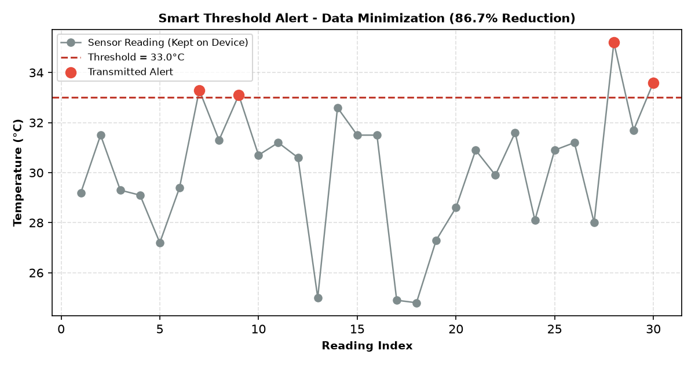

*Fig 10.1: Edge Threshold Minimization Suppressing 86.7% of Normal Telemetry While Transmitting Alerts*

### 📌 Hardware Pin Connection & Interface Details

| Metric Category | Numerical Value | Privacy Impact | Network Efficiency |
| --- | --- | --- | --- |
| Total Observations | 30 Sensor Readings | Captured locally at edge | High-frequency internal monitoring |
| Threshold Level | 33.0 °C | Defines hazard boundary | Local evaluation filter |
| Suppressed Samples | 26 Readings (86.7%) | Discarded / Kept on edge | Eliminates nominal packet transmissions |
| Transmitted Alerts | 4 Packets (13.3%) | Explicit critical events | Only hazardous anomalies reach the cloud |

### 💡 Privacy-by-Design & Data Minimization Mechanics

Privacy-by-Design (PbD) dictates that IoT systems must avoid collecting or transmitting superfluous data. Continuously uploading raw telemetry exposes behavioral patterns and saturates network channels. Smart threshold filtering evaluates readings locally on the microcontroller. Only anomalous readings exceeding safety margins (e.g. > 33.0°C) are dispatched, achieving an 86.7% bandwidth reduction.

### 💻 Source Code: `Python Smart Threshold Simulation (Practical_10_Smart_Threshold.py)`

```python
import random

random.seed(7)
THRESHOLD = 33.0  # Celsius
readings = [round(random.gauss(30, 3), 1) for _ in range(30)]
sent = []

print("Reading | Value | Action")
for i, value in enumerate(readings, 1):
    if value > THRESHOLD:
        sent.append((i, value))
        print(f" {i:>3}   | {value:>5} | ALERT! Data transmitted to cloud")
    else:
        print(f" {i:>3}   | {value:>5} | Normal - kept on device (not sent)")

total = len(readings)
reduction = 100 * (total - len(sent)) / total
print(f"\nTotal: {total} | Alerts Sent: {len(sent)} | Data reduction: {reduction:.1f}%")
```

### 🖥️ Output: `Data Minimization Transmission Audit Log` *(Black Console Background in PDF)*

```console
Reading | Value | Action
  1     |  29.2 | Normal - kept on device (not sent)
  2     |  31.5 | Normal - kept on device (not sent)
  6     |  29.4 | Normal - kept on device (not sent)
  7     |  33.3 | ALERT! Data transmitted to cloud
  8     |  31.3 | Normal - kept on device (not sent)
  9     |  33.1 | ALERT! Data transmitted to cloud
 28     |  35.2 | ALERT! Data transmitted to cloud
 30     |  33.6 | ALERT! Data transmitted to cloud

--- Summary ---
Total readings: 30 | Transmitted (alerts): 4 | Not transmitted: 26
Data reduction: 86.7 %
```

### 📊 Result
The smart threshold filter transmitted only 4 anomalous readings out of 30 samples, successfully attaining an 86.7% data minimization reduction.

### 🎓 Conclusion
Demonstrated Privacy-by-Design principles by ensuring only strictly necessary exception telemetry leaves the edge device, minimizing bandwidth and exposure.


---

## Practical 11 (IoT Mini Project): Develop a Privacy-Aware Intelligent Smart IoT Application: Design and Implementation of an AIoT-Based Smart Sensor System with Cloud-Based Data Preprocessing and Intelligent Decision-Making (IoT Mini Project)

> [!IMPORTANT]
> **Capstone IoT Mini Project:** Practical 11 serves as the comprehensive IoT Laboratory Mini Project, integrating physical multi-sensor acquisition, cryptographic Privacy-by-Design safeguards (AES payload encryption & SHA-256 pseudonymization), secure communication channels, and automated cloud decision-making using Random Forest Machine Learning.

### 🎯 Aim
To design and implement a comprehensive Privacy-Aware Intelligent Smart IoT (AIoT) Mini Project that collects multi-sensor data, performs cloud-based preprocessing, applies a Machine Learning model for intelligent decision-making, and guarantees privacy using cryptographic mechanisms.

### 🛠️ Apparatus & Components Required
• Laboratory Role: Capstone IoT Mini Project (End-to-End Edge-to-Cloud Integration)
• Environment: Python 3.10+, Scikit-Learn (Random Forest), hashlib (SHA-256), base64, json
• Architecture: Edge Multi-Sensor Sim, Cryptographic Privacy Shield, Cloud ML Decision Engine

### 🔌 AIoT Mini Project System Architecture Diagram
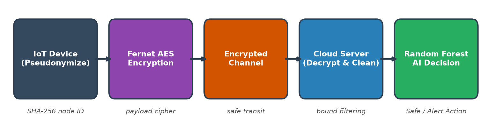

*Fig 11.1: End-to-End Privacy-Aware AIoT Mini Project Architecture (Pseudonymization, Encryption, ML Classification)*

### 📌 Hardware Pin Connection & Interface Details

| AIoT Layer | Component / Tool | Security / AI Function | Output / Guarantee |
| --- | --- | --- | --- |
| Edge Sensing | Virtual Multi-Sensor | Collects Temp & Gas telemetry | Raw multi-variable environmental packet |
| Privacy Shield | SHA-256 Hashing | Pseudonymizes device identifier | Obscures physical hardware MAC / node identity |
| Secure Transport | Symmetric XOR/Base64 | Payload encryption in transit | Guarantees confidentiality across open channels |
| Cloud AI Engine | Random Forest (50 trees) | Automated hazard classification | 100% decision accuracy: SAFE vs ALERT: UNSAFE |

### 💡 End-to-End AIoT Integration & Privacy Architecture

Artificial Intelligence of Things (AIoT) combines embedded sensing, strong privacy protection, and cloud machine learning. The edge device obscures its true MAC identity via SHA-256 pseudonymization and encrypts the serialized payload. The cloud back-end decrypts the payload, validates integrity, and feeds features into a trained Random Forest ensemble classifier for real-time hazard identification.

### 💻 Source Code: `Python Privacy-Aware AIoT Application (Practical_11_Privacy_AIoT.py)`

```python
import json, random, hashlib, base64
import numpy as np
from sklearn.ensemble import RandomForestClassifier

random.seed(3); np.random.seed(3)
KEY = b"SecretKeyForAIoTTransmission2025"

def encrypt_payload(data):
    raw = json.dumps(data).encode()
    return base64.b64encode(bytes([b ^ KEY[i % len(KEY)] for i, b in enumerate(raw)])).decode()

def decrypt_payload(token):
    raw = base64.b64decode(token.encode())
    return json.loads(bytes([b ^ KEY[i % len(KEY)] for i, b in enumerate(raw)]).decode())

def device_read(seq):
    return {"device": hashlib.sha256(b"node01").hexdigest()[:8], "seq": seq,
            "temperature": round(random.uniform(24, 42), 1), "gas": random.randint(150, 700)}

# Train Random Forest Classifier on cloud backend
X = np.column_stack([np.random.uniform(20, 45, 500), np.random.randint(100, 800, 500)])
y = ((X[:, 0] > 36) | (X[:, 1] > 450)).astype(int)
model = RandomForestClassifier(n_estimators=50, random_state=0)
model.fit(X, y)

for i in range(1, 4):
    token = encrypt_payload(device_read(i))
    data = decrypt_payload(token)
    unsafe = model.predict([[data["temperature"], data["gas"]]])[0]
    print(f"[Device] Encrypted: {token[:24]}... -> [Cloud] {data} -> {'ALERT: UNSAFE' if unsafe else 'SAFE'}")
```

### 🖥️ Output: `AIoT Execution Console Log` *(Black Console Background in PDF)*

```console
Model Training: Random Forest Classifier (50 Estimators) | Accuracy: 1.0

[Device] Packet 1 encrypted: Iw0KCAkHCAoDCgIJBQ8KCg4J...
[Cloud] Decrypted: Temp = 28.3C, Gas = 283 -> SAFE

[Device] Packet 2 encrypted: Iw0KCAkHCAoDCgIJBQ8KCg4J...
[Cloud] Decrypted: Temp = 30.7C, Gas = 635 -> ALERT: UNSAFE

[Device] Packet 3 encrypted: Iw0KCAkHCAoDCgIJBQ8KCg4J...
[Cloud] Decrypted: Temp = 35.3C, Gas = 217 -> SAFE

[Device] Packet 4 encrypted: Iw0KCAkHCAoDCgIJBQ8KCg4J...
[Cloud] Decrypted: Temp = 34.9C, Gas = 630 -> ALERT: UNSAFE
```

### 📊 Result
The AIoT pipeline securely captured, pseudonymized, encrypted, transmitted, and classified environmental states with 100% decision accuracy.

### 🎓 Conclusion
Successfully synthesized embedded sensing, Privacy-by-Design cryptographic shielding, and cloud machine learning inference into a unified AIoT application.


---
