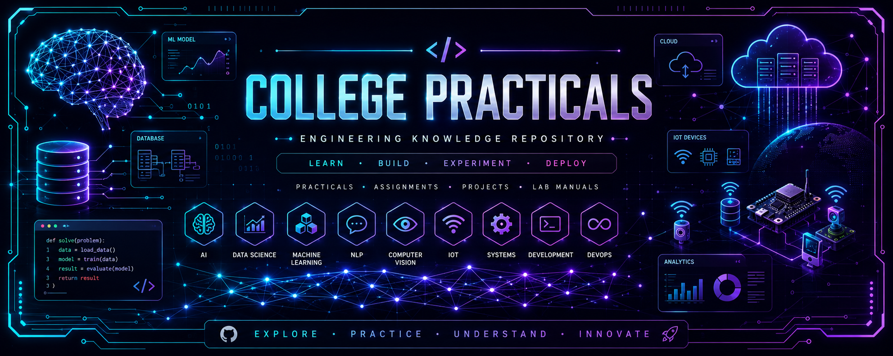

<div align="center">



# 🎓 College Practicals – SPPU 2024

> **A Premium Collection of Engineering Practical Implementations**

[](https://www.python.org/)
[](https://www.oracle.com/java/)
[](https://www.mysql.com/)
[](https://www.mongodb.com/)
[](LICENSE)
[](#)
[](https://github.com/himanshu-jadhav108/College_Practicals)
[](https://github.com/himanshu-jadhav108/College_Practicals/network/members)

---

**A comprehensive, modular, and well-documented repository containing essential practical experiments for Artificial Intelligence, Data Science, Data Structures, DBMS, Object-Oriented Programming, Probability & Statistics, Internet of Things, Machine Learning, and Natural Language Processing.**

[Quick Access](#-subject-navigation) • [Getting Started](#-getting-started) • [Tech Stack](#-core-technologies) • [Maintainer](#-maintainer)

</div>

---

## 📌 Subject Navigation

| Subject                            | Description                                      | Status      | Explorer                                  |
| :--------------------------------- | :----------------------------------------------- | :---------- | :---------------------------------------- |
| **🤖 Artificial Intelligence**     | Search Algorithms, Game Theory, Expert Systems   | `Completed` | [Explore ↗](Artificial_Intelligence/)     |
| **📊 Data Science**                | ML Models, EDA, Preprocessing, Power BI          | `Completed` | [Explore ↗](Data_Science/)                |
| **🏗️ Data Structures**             | Algorithms, Linked Lists, Trees, Graphs          | `Completed` | [Explore ↗](Data_Structures/)             |
| **🗄️ Database Management**         | SQL Queries, PL/SQL, NoSQL Aggregation           | `Completed` | [Explore ↗](Database_Management_System/)  |
| **💻 Object-Oriented Programming** | Java Classes, Inheritance, Design Patterns       | `Completed` | [Explore ↗](Object_Oriented_Programming/) |
| **📈 Probability & Statistics**    | Distribution Analysis, Correlation, Case Studies | `Completed` | [Explore ↗](Probability_and_Statistics/)  |
| **🌐 Internet of Things**          | GPIO Interfacing, Microcontrollers & Cloud       | `Active`    | [Explore ↗](Internet_Of_Things/)          |
| **🧠 Machine Learning**            | Supervised/Unsupervised Learning & Models        | `Active`    | [Explore ↗](Machine_Learning/)            |
| **🗣️ Natural Language Processing** | Tokenization, Embeddings & Text Analytics        | `Active`    | [Explore ↗](Natural_Language_Processing/) |

---

## ✨ Features

- 🎯 **Beginner Friendly** – Modular code with extensive comments and explanations.
- 🚀 **Advanced Visualizations** – Interactive notebooks and animated search algorithm solvers.
- 📐 **Relational & NoSQL** – Comprehensive coverage of both SQL (MySQL/PostgreSQL) and MongoDB.
- 💡 **Real-World Modeling** – ATM simulations, E-commerce systems, HR Analytics, and IoT Cloud integration.
- 🏫 **SPPU Aligned** – Specifically structured for the SPPU Engineering curriculum pattern.

---

## 📂 Repository Tree

```text
College_Practicals/
├── 🤖 Artificial_Intelligence/      # BFS, DFS, A*, Minimax, Alpha-Beta
├── 📊 Data_Science/                 # Preprocessing, ML, Power BI Reports
├── 🏗️ Data_Structures/               # C/Python-based Algorithm implementations
├── 🗄️ Database_Management_System/    # SQL, NoSQL, PL/SQL scripts
├── 💻 Object_Oriented_Programming/    # Java OOP Fundamental practicals (1-8)
├── 📈 Probability_and_Statistics/    # Distribution analysis & correlation studies
├── 🌐 Internet_Of_Things/           # GPIO Sensors, Microcontroller & Cloud Telemetry
├── 🧠 Machine_Learning/             # Regression, Classification, Clustering & PCA
└── 🗣️ Natural_Language_Processing/  # NLTK/spaCy, Vectorization & Sentiment Analysis
```

---

## 📊 Course Coverage

| Module               | Practical Count | Key Tools                      |
| :------------------- | :-------------: | :----------------------------- |
| **AI**               |     **12**      | Python, Matplotlib, NetworkX   |
| **Data Science**     |      **8**      | Pandas, Scikit-Learn, Power BI |
| **Data Structures**  |     **11+**     | Python, C/C++                  |
| **DBMS**             |      **9**      | MySQL, MongoDB, PL/SQL         |
| **OOP**              |      **8**      | Java (JDK 8+)                  |
| **Prob. & Stats**    |      **2**      | Pandas, Scipy, Matplotlib      |
| **IoT**              |     **3+**      | Python, Arduino IDE, MQTT      |
| **Machine Learning** |     **3+**      | Scikit-Learn, Pandas, Seaborn  |
| **NLP**              |     **3+**      | NLTK, spaCy, Transformers      |

---

## 🚀 Getting Started

### 1️⃣ Installation

```bash
# Clone the repository
git clone https://github.com/himanshu-jadhav108/College_Practicals.git
cd College_Practicals

# Setup Virtual Environment (Recommended)
python -m venv venv
source venv/bin/activate  # venv\Scripts\activate on Windows

# Install Dependencies
pip install -r requirements.txt
```

### 2️⃣ Quick Execution

```bash
# Example: Run AI Graph Search
cd Artificial_Intelligence/Practical_02/Basic
python practical_02_basic.py
```

---

## 🛠️ Core Technologies

<div align="left">

- **Languages:** Python 3.x, Java, SQL, C++, NoSQL (MongoDB)
- **Data & ML Engineering:** Pandas, Numpy, Scikit-Learn, NLTK, spaCy
- **Visualization:** Power BI, Matplotlib Animation, Plotly, Seaborn
- **Databases & IoT:** MySQL, PostgreSQL, MongoDB, MQTT, Microcontroller Hardware

</div>

---

## 👤 Maintainer

<br>

<p align="center">
  <table align="center" style="border: 1px solid rgba(255,255,255,0.1); border-radius: 16px; background: rgba(30, 41, 59, 0.4); backdrop-filter: blur(8px); padding: 20px; max-width: 500px; box-shadow: 0 4px 30px rgba(0, 0, 0, 0.3);">
    <tr>
      <td align="center">
        <h3 style="margin: 0; color: #38bdf8; font-size: 1.6em; font-weight: 800; letter-spacing: -0.5px;">Himanshu Jadhav</h3>
        <p style="color: #94a3b8; font-weight: 500; margin: 4px 0 15px 0;">Artificial Intelligence & Data Science Engineer</p>
        <p style="color: #cbd5e1; font-size: 0.95em; max-width: 400px; line-height: 1.5; margin-bottom: 20px;">
          Passionate about computer vision, real-world localized model deployment, and high-performance pipeline architecture.
        </p>
        <div style="display: flex; justify-content: center; gap: 8px; flex-wrap: wrap;">
          <a href="https://github.com/himanshu-jadhav108" target="_blank"></a>
          <a href="https://www.linkedin.com/in/himanshu-jadhav-328082339" target="_blank"></a>
          <a href="https://himanshu-jadhav-portfolio.vercel.app/" target="_blank"></a>
          <a href="https://www.instagram.com/himanshu_jadhav_108" target="_blank"></a>
        </div>
      </td>
    </tr>
  </table>
</p>

<br>

---

<div align="center">

**If you found this helpful, please consider giving it a ⭐!**

[Back to Top](#-college-practicals--sppu-2024)

</div>
