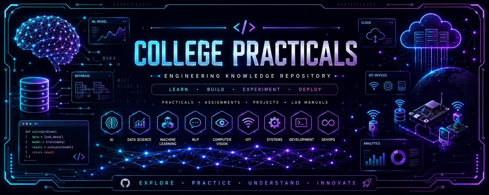

<div align="center">



# 🎓 College Practicals – SPPU 2024

> **A Comprehensive, Dual-Tiered Engineering Practical Laboratory Suite**  
> **Artificial Intelligence & Data Science | Savitribai Phule Pune University (SPPU)**  
> **Author:** Himanshu Jadhav

[](https://www.python.org/)
[](https://www.oracle.com/java/)
[](https://scikit-learn.org/)
[](https://pytorch.org/)
[](https://huggingface.co/)
[](https://www.mysql.com/)
[](https://www.mongodb.com/)
[](LICENSE)
[-brightgreen>)](#)
[](http://www.unipune.ac.in/)
[](https://github.com/himanshu-jadhav108/College_Practicals)
[](https://github.com/himanshu-jadhav108/College_Practicals/network/members)

---

**A production-grade, mathematically rigorous, and fully documented academic repository containing essential practical experiments, dual-track conceptual and advanced notebooks, and capstone engineering implementations for Artificial Intelligence, Data Science, Data Structures, DBMS, Object-Oriented Programming, Probability & Statistics, Internet of Things, Machine Learning, and Natural Language Processing.**

[Quick Access](#-subject-navigation) • [Key Highlights](#-key-features--highlights) • [Repository Tree](#-repository-directory-structure) • [Course Coverage](#-course-coverage--statistics) • [Getting Started](#-getting-started) • [Tech Stack](#-core-technologies--ecosystem) • [Maintainer](#-maintainer--academic-information)

</div>

---

## 📌 Subject Navigation

| Subject                            | Curriculum Focus & Highlights                                                                                         |           Modules / Projects            |   Status    |                 Explorer                  |
| :--------------------------------- | :-------------------------------------------------------------------------------------------------------------------- | :-------------------------------------: | :---------: | :---------------------------------------: |
| **🤖 Artificial Intelligence**     | Uninformed/Informed Search (BFS, DFS, A\*), Minimax Game Playing, Alpha-Beta Pruning, Expert Systems                  | **6 Practicals** _(12 Implementations)_ | `Completed` |   [Explore ↗](Artificial_Intelligence/)   |
| **📊 Data Science**                | Advanced Preprocessing, Exploratory Data Analysis (EDA), Statistical Modeling, Interactive Power BI Dashboards        |            **8 Practicals**             | `Completed` |        [Explore ↗](Data_Science/)         |
| **🏗️ Data Structures**             | C & Python-based Linear/Non-linear structures, Linked Lists, Trees, Graphs, Sorting, Algorithm Case Studies           |    **11+ Practicals & Mini Project**    | `Completed` |       [Explore ↗](Data_Structures/)       |
| **🗄️ Database Management**         | Relational Schemas, Complex SQL Queries, PL/SQL Stored Procedures & Triggers, NoSQL MongoDB Pipelines                 |    **9 Practicals & Mini Projects**     | `Completed` | [Explore ↗](Database_Management_System/)  |
| **💻 Object-Oriented Programming** | Core Java Architecture, Inheritance, Polymorphism, Interfaces, Exception Handling, OOP Design Patterns                |    **10 Practicals & Mini Project**     | `Completed` | [Explore ↗](Object_Oriented_Programming/) |
| **📈 Probability & Statistics**    | Probability Distributions, Hypothesis Testing, Correlation & Variance Analysis, Real-World Case Studies               |    **2 Comprehensive Case Studies**     | `Completed` | [Explore ↗](Probability_and_Statistics/)  |
| **🌐 Internet of Things**          | Microcontroller Architectures, GPIO Sensor Interfacing, Actuation, Telemetry Protocols & Cloud Integration            |       **Hardware Lab Practicals**       | `Completed` |     [Explore ↗](Internet_Of_Things/)      |
| **🧠 Machine Learning**            | Supervised & Unsupervised Learning, OLS, Polynomials, SVM, DBSCAN, Ensembles (Random Forest, Boosting), Grid World RL |   **11 Practicals** _(26 Notebooks)_    | `Completed` |      [Explore ↗](Machine_Learning/)       |
| **🗣️ Natural Language Processing** | Linguistic Preprocessing, Regex/DFA, Vector Space Models, N-grams, NER, Transformers & AniSense Capstone Project      |  **10 Practicals + Capstone Project**   | `Completed` | [Explore ↗](Natural_Language_Processing/) |

---

## ✨ Key Features & Highlights

- 🔬 **Dual-Track Implementation Pedagogy** – Every major laboratory domain (Machine Learning, Natural Language Processing, Artificial Intelligence) provides a two-tiered learning structure:
  - **🟢 Basic Track:** Clear, self-contained conceptual notebooks emphasizing fundamental principles, standard workflows, and core APIs.
  - **🚀 Advance Track:** Production-grade implementations with LaTeX mathematical formulations, custom algorithms built from scratch without black-box shortcuts, ablation studies, and publication-quality diagnostic plots.
- 📊 **Exhaustive Diagnostic Visualizations** – Includes residual homoscedasticity plots, learning curves, ROC-AUC / PR curves, Voronoi tessellations, decision boundary contours, Q-value surface plots, and ROUGE evaluation radar charts.
- 🧠 **Modern Transformer & Deep Learning Integration** – Practical deployment of Hugging Face Seq2Seq models (`DistilBART`), spaCy statistical pipelines (`en_core_web_sm`), and PyTorch neural components.
- 📐 **Enterprise-Grade Database Scripts** – Full relational modeling in MySQL/PostgreSQL alongside document-oriented aggregation pipelines in MongoDB.
- 🎮 **Applied Capstone & Mini-Projects** – Features real-world projects such as **AniSense** (Anime Sentiment & Hybrid Recommendation Engine), **The Shrine Trial** (Reinforcement Learning Grid World with Q-Learning and SARSA), and interactive Business Intelligence dashboards.
- 🏫 **100% SPPU Syllabus Alignment** – Structured specifically according to the Savitribai Phule Pune University (SPPU) Third-Year / Final-Year Engineering curriculum.

---

## 📂 Repository Directory Structure

```text
College_Practicals/
├── 🤖 Artificial_Intelligence/      # Dual-track implementations: BFS, DFS, A*, Minimax, Alpha-Beta, Expert Systems
├── 📊 Data_Science/                 # Preprocessing pipelines, Regression/Classification, Power BI Dashboards
├── 🏗️ Data_Structures/              # C/C++ & Python algorithm implementations, Case Studies & Mini Project
├── 🗄️ Database_Management_System/    # SQL DDL/DML, PL/SQL Procedures/Triggers, NoSQL MongoDB & Mini Projects
├── 💻 Object_Oriented_Programming/  # Java OOP fundamentals (Practicals 1-10), Design Patterns & Mini Project
├── 📈 Probability_and_Statistics/    # Distribution analysis, Correlation, Hypothesis testing & Unit 3-4 Case Studies
├── 🌐 Internet_Of_Things/           # GPIO sensor interfacing, Microcontrollers (ESP/Arduino) & MQTT Telemetry
├── 🧠 Machine_Learning/             # 11 Practicals (26 Dual-Track Notebooks): Regressions, SVM, DBSCAN, Ensembles & RL
└── 🗣️ Natural_Language_Processing/  # 10 Practicals (Dual-Track) + AniSense Capstone Recommendation Engine
```

---

## 📊 Course Coverage & Statistics

| Laboratory Domain               | Total Units / Practicals |   Notebooks / Scripts   | Primary Technologies & Libraries        | Key Highlights & Capstones                                                           |
| :------------------------------ | :----------------------: | :---------------------: | :-------------------------------------- | :----------------------------------------------------------------------------------- |
| **Artificial Intelligence**     |     **6 Practicals**     |   12 Implementations    | Python, Matplotlib, NetworkX            | Dual-Track Basic/Advance, Animated Graph Visualizations, Minimax Game Engines        |
| **Data Science**                |     **8 Practicals**     |  8 Notebooks + Reports  | Pandas, NumPy, Scikit-Learn, Power BI   | Exploratory Data Analysis, Outlier Filtering, Executive Dashboard Reports            |
| **Data Structures**             |    **11+ Practicals**    |    30+ Source Files     | C, C++, Python                          | Core Abstract Data Types, Tree Traversals, Graph Shortest Paths, Mini Project        |
| **DBMS**                        |     **9 Practicals**     |       20+ Scripts       | MySQL, PostgreSQL, MongoDB, PL/SQL      | Relational Normalization, Indexing, Triggers, Aggregation Pipelines                  |
| **Object-Oriented Programming** |    **10 Practicals**     |    25+ Java Classes     | Java (JDK 8+), Eclipse / IntelliJ       | Polymorphism, Custom Exceptions, Multithreading, Banking/ATM Simulations             |
| **Probability & Statistics**    |    **2 Case Studies**    | Comprehensive Notebooks | Pandas, SciPy, Matplotlib               | Real-World Empirical Distributions, Central Limit Theorem, Hypothesis Testing        |
| **Internet of Things**          |    **Hardware Labs**     | Embedded Code & Guides  | C/C++, Arduino IDE, Python, MQTT        | Sensor Interfacing, Cloud Telemetry, Actuator Automation                             |
| **Machine Learning**            |    **11 Practicals**     |    **26 Notebooks**     | Scikit-Learn, NumPy, SciPy, Statsmodels | Dual-Track (Basic & Advance), Bias-Variance Diagnostics, GridSearchCV, Grid World RL |
| **Natural Language Processing** |    **10 Practicals**     |    **14 Notebooks**     | NLTK, spaCy, PyTorch, Transformers      | Dual-Track (Basic & Advance), Seq2Seq Summarization, AniSense Capstone Project       |

---

## 🚀 Getting Started

### 1️⃣ Clone the Repository

```bash
git clone https://github.com/himanshu-jadhav108/College_Practicals.git
cd College_Practicals
```

### 2️⃣ Global Environment Setup

Create and activate a central Python virtual environment (Python 3.10+ recommended):

```bash
# Create the virtual environment
python -m venv venv

# Activate on Windows (PowerShell)
.env\Scripts\Activate.ps1

# Activate on Windows (Command Prompt)
.env\Scriptsctivate.bat

# Activate on Linux / macOS
source venv/bin/activate

# Upgrade pip and install core repository dependencies
pip install --upgrade pip
pip install -r requirements.txt
```

### 3️⃣ Subject-Specific Specialized Environments

For dedicated domains with specialized packages (e.g. Hugging Face Transformers, spaCy linguistic models, Statsmodels), enter the respective subject directory and follow its local `README.md`:

```bash
# Example: Running Machine Learning Lab
cd Machine_Learning
pip install -r requirements.txt
jupyter notebook

# Example: Running Natural Language Processing Lab
cd ../Natural_Language_Processing
pip install -r requirements.txt
python -m spacy download en_core_web_sm
jupyter notebook
```

---

## 🛠️ Core Technologies & Ecosystem

<div align="left">

| Category                             | Technologies & Tools                                                           |
| :----------------------------------- | :----------------------------------------------------------------------------- |
| **Programming Languages**            | `Python 3.10+`, `Java (JDK 8+)`, `C / C++`, `SQL`, `JavaScript`                |
| **Machine Learning & Deep Learning** | `Scikit-Learn`, `PyTorch`, `Hugging Face Transformers`, `Statsmodels`, `SciPy` |
| **NLP & Linguistic Processing**      | `NLTK`, `spaCy` (`en_core_web_sm`), `WordCloud`, `ROUGE-Score`                 |
| **Data Engineering & Manipulation**  | `NumPy`, `Pandas`, `JSON`, `CSV / TSV / Parquet`                               |
| **Visualization & Reporting**        | `Matplotlib`, `Seaborn`, `Plotly`, `NetworkX`, `Microsoft Power BI`            |
| **Databases & Query Systems**        | `MySQL`, `PostgreSQL`, `MongoDB (NoSQL)`, `PL/SQL`                             |
| **Hardware & IoT Telemetry**         | `ESP8266 / ESP32`, `Arduino Uno`, `MQTT Protocol`, `GPIO Sensors`              |
| **Interactive Environments**         | `Jupyter Notebook`, `JupyterLab`, `VS Code`, `Google Colab`                    |

</div>

---

## 👤 Maintainer & Academic Information

<br>

<p align="center">
  <table align="center" style="border: 1px solid rgba(255,255,255,0.1); border-radius: 16px; background: rgba(30, 41, 59, 0.4); backdrop-filter: blur(8px); padding: 24px; max-width: 550px; box-shadow: 0 4px 30px rgba(0, 0, 0, 0.3);">
    <tr>
      <td align="center">
        <h3 style="margin: 0; color: #38bdf8; font-size: 1.7em; font-weight: 800; letter-spacing: -0.5px;">Himanshu Jadhav</h3>
        <p style="color: #38bdf8; font-weight: 600; margin: 4px 0 2px 0;">Roll Number: TE-32</p>
        <p style="color: #94a3b8; font-weight: 500; margin: 2px 0 15px 0;">Artificial Intelligence & Data Science Engineer | SPPU (2024 – 2028)</p>
        <p style="color: #cbd5e1; font-size: 0.95em; max-width: 440px; line-height: 1.5; margin-bottom: 20px;">
          Passionate about machine learning architectures, statistical diagnostics, natural language processing, and production-grade engineering pipelines.
        </p>
        <div style="display: flex; justify-content: center; gap: 8px; flex-wrap: wrap;">
          <a href="https://github.com/himanshu-jadhav108" target="_blank"></a>
          <a href="https://www.linkedin.com/in/himanshu-jadhav-328082339" target="_blank"></a>
          <a href="https://himanshu-jadhav-portfolio.vercel.app/" target="_blank"></a>
          <a href="https://www.instagram.com/himanshu_jadhav_108" target="_blank"></a>
        </div>
      </td>
    </tr>
  </table>
</p>

<br>

---

<div align="center">

**⭐ If you find this repository valuable for your academic study or development, please consider starring it!**

[Back to Top](#-college-practicals--sppu-2024)

</div>
